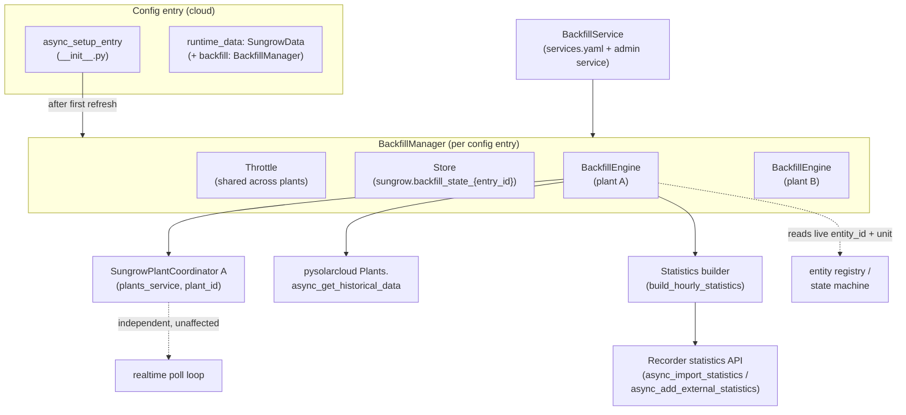

# Design Document

## Overview

This feature adds a **Backfill** capability to the Sungrow iSolarCloud integration: on first
setup (and on demand thereafter) it pulls minute-level historical measure-point data from
iSolarCloud through `pysolarcloud`'s `Plants.async_get_historical_data`, aggregates it into
whole-hour Home Assistant long-term statistics, and imports it so the History and Energy
dashboards are populated immediately instead of filling in slowly from live polling.

The core of the feature is a new module, `backfill.py`, whose `BackfillEngine` orchestrates
exactly one Backfill run per `SungrowPlantCoordinator`. A run:

1. Resolves the set of **Backfill_Points** (cumulative yield/energy points and power points)
   for the plant, and for each resolves the target **Statistic_Id** and unit from the live
   sensor (falling back to a `sungrow:`-prefixed external series).
2. Splits the bounded **History_Window** into **Time_Chunks** (fitting the endpoint's per-call
   window) and the points into **Point_Batches** of ≤ 50, then issues throttled
   `async_get_historical_data` calls in ascending chronological order.
3. Aggregates the returned minute rows into hourly `StatisticData`: a monotonic running `sum`
   plus per-hour `state` for cumulative energy, and `mean`/`min`/`max` for power.
4. Imports the statistics through the recorder helpers (`async_import_statistics` for series
   backed by a live entity, `async_add_external_statistics` for external series), which
   overwrite cleanly by `(statistic_id, start_hour)` and so make re-runs idempotent.
5. Persists a completion marker (via `Store`) recording the covered window, so an automatic
   run happens only once per plant.

The engine runs as a background `asyncio.Task` tracked on `entry.runtime_data`, entirely
separate from the coordinator's realtime poll loop, so realtime polling is never blocked or
delayed. It reuses the existing E998/E999 rate-limit classification (`is_rate_limit_error`)
and the `ConfigEntryAuthFailed` reauth path, and surfaces partial failures as a HA Repair.

This feature is cloud-only. A Modbus-only (cloud-free) entry has no `plants_service` and never
runs a Backfill (Requirement 1.2).

### Requirements coverage map

| Design section | Requirements |
| --- | --- |
| Lifecycle & startup (Architecture, `BackfillEngine`) | 1.1, 1.2, 1.3, 1.4, 1.5 |
| On-demand service (`BackfillService`) | 2.1, 2.2, 2.3, 2.4, 2.5 |
| History window resolution (`WindowResolver`) | 3.1, 3.2, 3.3, 3.4, 3.5 |
| Chunking (`chunk_time_window`, `batch_points`) | 4.1, 4.2, 4.3, 4.4 |
| Statistics builder (`build_hourly_statistics`) | 4.5, 6.3, 7.1, 7.2, 7.6 |
| Rate-limit/throttle (`Throttle`, run loop) | 5.1, 5.2, 5.3, 5.4, 5.5, 5.6 |
| Idempotent import (`import_statistics`) | 6.1, 6.2, 6.4 |
| Series identification (`resolve_series`) | 7.3, 7.4, 7.5, 9.2 |
| Failure handling & summary (run loop, Repairs) | 8.1, 8.2, 8.3, 8.4, 8.5, 8.6 |
| Multi-plant orchestration (`BackfillManager`) | 9.1, 9.2, 9.3, 9.4 |

## Architecture

### Component overview



- **`BackfillManager`** — one per config entry, stored on `runtime_data.backfill`. Owns the
  shared `Throttle`, the persistence `Store`, and one `BackfillEngine` per coordinator. It
  starts automatic runs after setup, dispatches on-demand service calls, and tracks the
  background tasks so unload can cancel them (Requirements 1.5, 9.1, 9.4).
- **`BackfillEngine`** — orchestrates one run for one plant: window resolution, chunking,
  throttled API calls, aggregation, import, marker persistence, and run summary.
- **Statistics builder** — pure functions that turn minute rows into hourly `StatisticData`.
  No I/O, so they are the primary property-test surface.
- **`BackfillService`** — registers the `sungrow.backfill` service and translates a call into
  `BackfillManager` invocations.

### Ownership and lifecycle

The engine is owned **per config entry** through `BackfillManager`, with one `BackfillEngine`
**per coordinator**. This mirrors the existing structure (`SungrowData.coordinators` is a list;
heartbeats are tracked per plant on `runtime_data`).

`SungrowData` gains one field:

```python
@dataclass
class SungrowData:
    coordinators: list[SungrowPlantCoordinator]
    control: Control | None
    devices: dict[str, list[dict[str, Any]]]
    heartbeats: dict[str, tuple[asyncio.Event, asyncio.Task[None]]] = field(default_factory=dict)
    backfill: "BackfillManager | None" = None   # None for Modbus-only entries
```

**Startup (Requirements 1.1, 1.2):** In `async_setup_entry` (cloud path only), after the plant
"service" devices are registered and platforms are forwarded, the manager is constructed and
`manager.async_start_automatic()` is called. It is scheduled with `entry.async_create_background_task`
so it never delays setup completion or the first realtime poll. The Modbus-only setup path
(`_async_setup_modbus_only`) never constructs a manager, satisfying 1.2. Automatic start is
also gated on `EVENT_HOMEASSISTANT_STARTED` / recorder readiness so imports never race the
recorder starting up.

**Per-plant gating (Requirements 1.1, 1.4):** For each coordinator, the engine loads its
persisted marker; if a completed marker already covers the default window, no automatic run is
started for that plant. Otherwise one run is started covering the default window.

**Cancellation on unload (Requirement 1.5):** Every run is an `asyncio.Task` tracked in
`BackfillManager._tasks`. `async_unload_entry` calls `manager.async_shutdown()` which cancels
outstanding tasks and awaits them. Because each recorder import is an atomic call that only
ever *overwrites* whole hours already fully aggregated, cancelling between imports cannot
corrupt previously imported statistics — at worst a run stops partway with earlier hours
already durably imported, which a later run re-imports identically.

### Concurrency and realtime isolation (Requirements 5.4, 5.5)

The Backfill run loop is `await`-based and lives on its own task. The coordinator's poll loop
is driven independently by `DataUpdateCoordinator`'s timer. The only shared resource is the
iSolarCloud quota, handled by the throttle rather than by mutual exclusion, so a Backfill in
progress never defers a due realtime poll. Within a config entry, all engines share a single
`Throttle` so the combined call rate across concurrently-backfilling plants stays under the
limit (Requirement 9.4).

### End-to-end sequence (one plant)

```mermaid
sequenceDiagram
    participant M as BackfillManager
    participant E as BackfillEngine
    participant W as WindowResolver
    participant T as Throttle
    participant API as pysolarcloud
    participant B as Statistics builder
    participant R as Recorder stats API
    participant S as Store

    M->>E: async_run(window override?)
    E->>W: resolve(window)
    W-->>E: [start, end] (clamped, validated)
    E->>E: resolve_series() -> per-point Statistic_Id + unit + kind
    loop each Time_Chunk (ascending) x each Point_Batch (<=50)
        E->>T: await acquire()
        T-->>E: (throttled slot)
        E->>API: async_get_historical_data(plant, s, e, points, 5min)
        alt Rate_Limit_Error (E998/E999)
            API-->>E: raise
            E->>T: back off; retry same chunk
        else transient error
            API-->>E: raise
            E->>E: retry <= N; else mark chunk failed
        else auth error
            API-->>E: raise
            E->>M: stop run, defer to reauth
        else ok
            API-->>E: minute rows
            E->>B: build_hourly_statistics(rows, series, carry_sum)
            B-->>E: StatisticData[] + updated carry_sum
            E->>R: import/add statistics (overwrite by start_hour)
        end
    end
    E->>S: persist marker(window, outcome)
    E->>M: run summary (imported hours, empty ranges, failed chunks)
```

## Components and Interfaces

### `BackfillManager`

```python
class BackfillManager:
    """Owns one BackfillEngine per coordinator for a config entry, plus the shared throttle."""

    def __init__(self, hass: HomeAssistant, entry: SungrowConfigEntry) -> None: ...

    async def async_start_automatic(self) -> None:
        """Start an automatic run for each coordinator lacking a completed default-window marker.
        Requirements: 1.1, 1.4, 9.1."""

    async def async_run_on_demand(
        self, *, plant_ids: list[str] | None, start_date: datetime | None
    ) -> None:
        """Start on-demand runs for the addressed coordinators (all if plant_ids is None).
        Rejects a plant already running. Requirements: 2.2, 2.3, 2.4, 9.1."""

    def is_running(self, plant_id: str) -> bool:
        """Requirement 2.4."""

    async def async_shutdown(self) -> None:
        """Cancel and await all in-flight run tasks. Requirement 1.5."""
```

Internals: `_engines: dict[str, BackfillEngine]` keyed by `plant_id`; `_tasks: dict[str, asyncio.Task]`;
`_throttle: Throttle` shared to all engines; `_store: Store` shared for the marker record.
Starting a run creates a task via `entry.async_create_background_task`; on task completion the
manager logs the returned `RunSummary`, raises/clears the partial-failure Repair, and drops the
task from `_tasks`. Per-plant runs are wrapped so one plant's failure does not stop the others
(Requirement 9.3).

### `BackfillEngine`

```python
class BackfillEngine:
    def __init__(
        self,
        hass: HomeAssistant,
        coordinator: SungrowPlantCoordinator,
        throttle: "Throttle",
        store: "BackfillStore",
    ) -> None: ...

    async def async_run(self, *, start_date: datetime | None = None) -> "RunSummary":
        """Execute one full Backfill run for this plant. Requirements: 1.3, 4.*, 5.*, 6.*, 8.*."""

    async def async_resolve_series(self) -> list["SeriesTarget"]:
        """Map each Backfill_Point to its Statistic_Id, unit and kind. Requirements: 7.3–7.6, 9.2."""
```

Key responsibilities and how each maps to existing code:

- **Backfill_Point selection.** Backfill imports two classes of points:
  - *Cumulative energy* (state_class `TOTAL_INCREASING`): e.g. `total_yield` (83024),
    `total_pv_yield`, `feed_in_energy_total`, `total_purchased_energy`, meter totals — resolved
    by asking `resolve_classification` for `(SensorDeviceClass.ENERGY, TOTAL_INCREASING)`.
  - *Power* (state_class `MEASUREMENT`, device class POWER): e.g. `power` (83033), `load_power`,
    `grid_active_power` — resolved by `(SensorDeviceClass.POWER, MEASUREMENT)`.
  The candidate point codes come from `coordinator.plants_service.measure_points`, classified via
  the same `resolve_classification`/`_UNIT_CLASS_MAP` the sensor platform uses, so backfilled
  series line up with the live sensors by construction.

- **Series resolution (`async_resolve_series`, Requirements 7.3–7.6, 9.2).** The live sensor's
  `unique_id` is `f"{plant_id}_{point_code}"`. The engine looks it up in the entity registry:
  `entity_registry.async_get_entity_id("sensor", DOMAIN, f"{plant_id}_{point_code}")`.
  - If found → **live-entity series**: `statistic_id = entity_id` (e.g. `sensor.plant_total_yield`),
    imported with `async_import_statistics` and `StatisticMetaData(source="recorder")`. The unit
    is taken from the live entity's current statistics/`unit_of_measurement` (the recorder's
    metadata or the entity's `native_unit_of_measurement`) so historical and live share one
    series with a matching unit (7.3, 7.5).
  - If not found → **external series**: `statistic_id = f"sungrow:{plant_id}_{point_code}"`,
    imported with `async_add_external_statistics` and `StatisticMetaData(source=DOMAIN)` (7.4).
    Scoping by `plant_id` guarantees no cross-plant collisions (9.2).
  - The `has_mean`/`has_sum` metadata is derived from kind: energy → `has_sum=True`,
    `has_mean=False`; power → `has_mean=True`, `has_sum=False`, matching the live sensor's
    `state_class` so the import is accepted by the recorder (7.1, 7.2).

- **Unit conversion (Requirements 7.5, 7.6).** The historical endpoint returns Wh for energy
  points; the live sensors normalise Wh→kWh via `energy_units.normalize_energy_point`. The engine
  reuses that exact function on each minute row before aggregation, so the imported series unit
  (kWh) equals the live series unit. Power values are already W. If a resolved live unit differs
  from the source unit for any point, the same normalisation table is applied before import.

### `WindowResolver` (Requirement 3)

```python
@dataclass(frozen=True)
class HistoryWindow:
    start: datetime  # UTC
    end: datetime    # UTC, = now

def resolve_window(
    *, now: datetime, option_days: int | None, start_override: datetime | None
) -> HistoryWindow:
    """Requirements 3.1–3.5. Raises InvalidRangeError when start_override > now (3.5)."""
```

- Default length `DEFAULT_BACKFILL_DAYS = 30` (3.1); configurable via option
  `CONF_BACKFILL_DAYS` (3.2); clamped to `MAX_BACKFILL_DAYS = 365` with a log line when exceeded
  (3.3). Every resolved window is finite (3.4). A `start_override` after `now` raises
  `InvalidRangeError` (3.5). `end` is always `dt_util.utcnow()`.

### Chunking (Requirement 4)

```python
def chunk_time_window(window: HistoryWindow, chunk: timedelta) -> list[tuple[datetime, datetime]]:
    """Split [start, end) into consecutive, non-overlapping sub-ranges each <= chunk,
    returned in ascending chronological order. Requirements 4.2, 4.3, 4.4."""

def batch_points(points: list[SeriesTarget], max_size: int = 50) -> list[list[SeriesTarget]]:
    """Partition points into batches of at most max_size. Requirement 4.1."""
```

- `MAX_POINTS_PER_CALL = 50` (4.1). The endpoint's default window is 3h; the engine uses a
  conservative `CHUNK_WINDOW = timedelta(hours=3)` with an explicit `start_time` and `end_time`
  on every call (4.3), and requests `interval = timedelta(minutes=5)` to match iSolarCloud's ~5
  minute cadence while keeping row counts bounded. Chunks are consumed in ascending order so a
  cumulative point's running `sum` is built forward in time (4.4).

### Statistics builder (pure functions — primary test surface)

```python
@dataclass(frozen=True)
class SeriesTarget:
    point_code: str
    statistic_id: str
    unit: str | None
    kind: Literal["energy", "power"]
    is_external: bool
    metadata: StatisticMetaData

def build_hourly_statistics(
    rows: list[MinuteRow],           # minute rows for ONE series, any order
    kind: Literal["energy", "power"],
    *,
    running_sum: float = 0.0,        # carried across chunks for energy (Requirement 4.5)
) -> tuple[list[StatisticData], float]:
    """Aggregate minute rows into hourly StatisticData aligned to hour start (UTC).

    energy: per hour, state = last cumulative value in that hour; sum = running total that is
            non-decreasing across the whole window (4.5, 7.1). Returns updated running_sum.
    power:  per hour, mean/min/max over the hour's samples (7.2).
    Requirements: 6.3 (whole-hour alignment), 4.5, 7.1, 7.2.
    """
```

Hour alignment uses `dt_util` with UTC: each row's timestamp is floored to the hour
(`start_hour = ts.replace(minute=0, second=0, microsecond=0)`, tz=UTC). For energy, the hourly
`state` is the cumulative reading at (or last within) the hour; `sum` is the running cumulative
delta from the window start, and the builder enforces non-decreasing `sum` by clamping any
negative minute-to-minute delta to zero (guards meter resets / spurious dips) (4.5).

### Import (Requirement 6)

```python
def import_statistics(hass: HomeAssistant, target: SeriesTarget, data: list[StatisticData]) -> None:
    """Route to async_add_external_statistics (external) or async_import_statistics (live entity).
    Both overwrite by (statistic_id, start_hour), giving idempotency. Requirements 6.1, 6.2, 6.4."""
```

Both recorder helpers replace any existing row with the same `(statistic_id, start)` rather than
appending, so re-importing the same hours is a clean overwrite (6.1, 6.2), and re-importing a
retried chunk only touches that chunk's hours (6.4).

### `Throttle` (Requirements 5.1, 5.2, 5.3, 9.4)

```python
class Throttle:
    def __init__(self, min_interval: float, hass: HomeAssistant) -> None: ...
    async def acquire(self) -> None:
        """Await until at least min_interval has elapsed since the previous acquire.
        Serialises calls across all engines of the entry (shared instance). Requirements 5.1, 9.4."""
    async def backoff(self) -> None:
        """Sleep an escalating delay after a Rate_Limit_Error before the next attempt (5.2)."""
    def reset_backoff(self) -> None: ...
```

Backoff escalation mirrors the coordinator's doubling scheme (`_adjust_poll_backoff`), capped at
one hour. On resume after a rate-limit backoff, the run continues from the first not-yet-imported
`(Time_Chunk, Point_Batch)`, tracked by an index cursor (5.3).

### `BackfillService` (Requirement 2)

Registers `sungrow.backfill` via `hass.services.async_register` at component `async_setup` (or
first cloud entry setup), described by `services.yaml`:

```yaml
backfill:
  name: Backfill historical statistics
  description: Import historical iSolarCloud data into long-term statistics.
  fields:
    config_entry:
      selector: { config_entry: { integration: sungrow } }
    start_date:
      selector: { date: {} }
```

The handler resolves the addressed config entries/plants, then calls
`manager.async_run_on_demand(plant_ids=..., start_date=...)` (2.1, 2.2, 2.3). A plant already
running is rejected and reported (2.4). Registered as an admin service.

## Data Models

### `MinuteRow` (parsed from `async_get_historical_data`)

```python
@dataclass(frozen=True)
class MinuteRow:
    timestamp: datetime  # UTC
    value: float         # normalised to the target unit (Wh->kWh for energy)
```

Source shape per point (from `pysolarcloud`): `{"timestamp": datetime, "id": str, "code": str,
"value": float|str, "unit": str, "name": str}`. Rows whose `value` is `None`/`""`/non-numeric are
dropped before aggregation.

### `StatisticData` and `StatisticMetaData` (HA recorder)

Energy (cumulative) series:

```python
StatisticMetaData(
    has_mean=False, has_sum=True,
    name=None,
    source="recorder",                       # or DOMAIN for external
    statistic_id="sensor.<plant>_total_yield",  # or "sungrow:<plant_id>_total_yield"
    unit_of_measurement="kWh",
)
StatisticData(start=<hour, UTC>, state=<cumulative reading>, sum=<running total>)
```

Power (measurement) series:

```python
StatisticMetaData(
    has_mean=True, has_sum=False,
    name=None, source="recorder", statistic_id="sensor.<plant>_power",
    unit_of_measurement="W",
)
StatisticData(start=<hour, UTC>, mean=<avg>, min=<min>, max=<max>)
```

### Persisted marker (`Store`)

`Store[dict]` at key `f"{DOMAIN}.backfill_state_{entry.entry_id}"`, version 1:

```json
{
  "plants": {
    "<plant_id>": {
      "completed": true,
      "partial": false,
      "window_start": "2024-01-01T00:00:00+00:00",
      "window_end": "2024-01-31T00:00:00+00:00",
      "last_run": "2024-01-31T09:12:00+00:00",
      "failed_chunks": 0
    }
  }
}
```

`completed` + `window_*` drive the "don't auto-run again" gate (1.3, 1.4, 2.5). `partial`/`failed_chunks`
drive the Repair and let a re-run target gaps (8.1).

### New options / constants (`const.py`)

```python
CONF_BACKFILL_DAYS = "backfill_days"
DEFAULT_BACKFILL_DAYS = 30
MAX_BACKFILL_DAYS = 365
BACKFILL_INTERVAL = timedelta(minutes=5)
BACKFILL_CHUNK_WINDOW = timedelta(hours=3)
MAX_POINTS_PER_CALL = 50
BACKFILL_MIN_CALL_INTERVAL = 1.0     # seconds between historical calls (throttle)
BACKFILL_MAX_RETRIES = 3             # transient-error retries per chunk (5.6)
```

## Correctness Properties

*A property is a characteristic or behavior that should hold true across all valid executions of
a system — essentially, a formal statement about what the system should do. Properties serve as
the bridge between human-readable specifications and machine-verifiable correctness guarantees.*

The Backfill logic is dominated by pure functions (window resolution, chunking, aggregation,
unit conversion, series-id derivation), which makes property-based testing a strong fit. The
following properties are derived from the prework analysis, consolidated to remove redundancy
(the window-resolution criteria collapse to one property; the chunk-structure criteria to one;
and the idempotency/hour-alignment/locality criteria to one).

### Property 1: Window resolution is bounded and honors configuration

*For any* `now`, optional configured day count, and optional `start_date` that is not later than
`now`, `resolve_window` returns a finite window whose `end` equals `now`, whose length is
`clamp(requested_length, 1 day, MAX_BACKFILL_DAYS)`, and whose `start` equals the explicit
`start_date` when one is supplied (subject to the same clamp). When `start_date` is later than
`now`, it raises `InvalidRangeError`.

**Validates: Requirements 2.3, 3.1, 3.2, 3.3, 3.4, 3.5**

### Property 2: Point batching preserves all points and never exceeds the cap

*For any* list of `SeriesTarget`s and any `max_size` ≤ 50, `batch_points` produces batches that
each contain at most `max_size` points, and whose in-order concatenation equals the original list
(no point dropped, duplicated, or reordered).

**Validates: Requirements 4.1**

### Property 3: Time chunking covers the window in ascending, bounded, non-overlapping pieces

*For any* `HistoryWindow` and positive chunk size, `chunk_time_window` returns chunks that are
sorted ascending by start, are contiguous and non-overlapping, together exactly cover
`[start, end)`, and each have a duration no greater than the chunk size.

**Validates: Requirements 4.2, 4.3, 4.4**

### Property 4: Cumulative energy sum is non-decreasing across the whole window

*For any* sequence of minute rows for an energy series (including rows split across multiple
chunks and aggregated with a carried `running_sum`), the hourly `sum` values produced by
`build_hourly_statistics` are non-decreasing in chronological order.

**Validates: Requirements 4.5, 7.1**

### Property 5: Aggregation is deterministic and import is idempotent and hour-local

*For any* set of minute rows, `build_hourly_statistics` is deterministic (equal input yields
equal output) and produces exactly one `StatisticData` per (series, hour) with every `start`
aligned to an exact UTC hour boundary. Consequently, importing the rows into an
`(statistic_id, start_hour)`-keyed store — whether all at once or chunk-by-chunk, and whether run
once or twice — yields an identical stored map, and re-importing one chunk changes only that
chunk's hours.

**Validates: Requirements 6.1, 6.2, 6.3, 6.4**

### Property 6: Energy unit conversion is correct and stable

*For any* numeric source value reported in Wh, normalisation yields `round(value / 1000, 3)` with
unit `kWh`; for any value already in kWh (or a non-energy unit), the value is unchanged.

**Validates: Requirements 7.5, 7.6**

### Property 7: Statistic_Ids are scoped per plant and never collide

*For any* two distinct `plant_id`s and any point code, the external `Statistic_Id`s derived by
series resolution (`f"sungrow:{plant_id}_{code}"`) are distinct, so different plants' series
cannot collide.

**Validates: Requirements 9.2**

## Error Handling

The run loop classifies every `async_get_historical_data` failure and reacts per its class,
reusing the coordinator's existing helpers so behaviour matches the realtime path:

- **Authentication errors (`is_auth_error`, Requirement 8.5).** Stop the run immediately and
  defer to the integration's existing reauth handling. The engine does not open its own reauth
  flow; the coordinator's realtime poll (or setup) raises `ConfigEntryAuthFailed` as it already
  does. The run records its partial outcome so far and exits.
- **Rate-limit errors (`is_rate_limit_error`, E998/E999, Requirements 5.2, 5.3).** Pause the run,
  call `Throttle.backoff` (escalating delay, capped at 1 hour), then resume from the first
  `(Time_Chunk, Point_Batch)` not yet successfully imported using the progress cursor. The engine
  does not touch the coordinator's Repairs; a long rate-limit is expected on the free plan.
- **Transient errors (anything else non-auth, non-rate-limit; Requirement 5.6).** Retry the same
  call up to `BACKFILL_MAX_RETRIES` times with a short delay. On exhaustion, mark that chunk as
  failed, continue with the remaining chunks (Requirement 8.1), and count it in the summary.
- **Empty ranges (Requirement 8.3).** A call that returns no rows for its range logs at debug and
  contributes no statistics; the run continues and completes normally.
- **Partial failure (Requirements 8.1, 8.2).** If any chunk is marked failed, the run still
  imports every successfully retrieved chunk, records the marker as `partial=true` with a
  `failed_chunks` count, and the manager raises a non-fixable HA Repair
  (`ir.async_create_issue`, translation key `backfill_partial`, learn-more pointing at the
  troubleshooting doc) describing the partial failure and how to re-run. A later fully successful
  run clears the Repair.
- **Cancellation (Requirement 1.5).** On unload/reload, `async_shutdown` cancels the task; the
  loop catches `asyncio.CancelledError` between imports, leaving all already-imported hours
  durable and re-importable identically on the next run.
- **Logging & summary (Requirements 8.4, 8.6).** The engine logs run start (plant, window),
  per-chunk progress, and a final outcome. It returns a `RunSummary(imported_hours,
  skipped_empty_ranges, failed_chunks, statistic_ids)` that the manager logs and uses to decide
  the marker and Repair state.

```python
@dataclass(frozen=True)
class RunSummary:
    plant_id: str
    window: HistoryWindow
    imported_hours: int
    skipped_empty_ranges: int
    failed_chunks: int
    completed: bool          # True when no failed chunks
```

## Testing Strategy

The feature separates cleanly into a **pure logic core** (property-tested) and an **I/O
orchestration shell** (example/integration-tested with mocks), matching the prework
classification.

### Property-based tests

Library: **Hypothesis** (already the ecosystem standard for pytest; add to the test deps if not
present). Each property test runs a minimum of **100 iterations** (`@settings(max_examples=100)`)
and is tagged with a comment referencing its design property:

`# Feature: backfill-historical-statistics, Property N: <property text>`

- **Property 1 — Window resolution.** Generate `now`, `option_days` (including values > MAX and
  ≤ 0), and optional `start_date` (before and after `now`). Assert finiteness, `end == now`,
  clamped length, honored override, and `InvalidRangeError` for future start dates. Generators
  cover the edge cases from 3.5/8.3.
- **Property 2 — Point batching.** Generate random point lists and `max_size ∈ [1, 50]`; assert
  batch-size cap and order-preserving concatenation.
- **Property 3 — Time chunking.** Generate windows and chunk sizes; assert ascending, contiguous,
  non-overlapping, full coverage, and per-chunk duration bound.
- **Property 4 — Non-decreasing sum.** Generate minute rows (monotonic-ish cumulative readings
  plus noise, gaps, resets); split them across chunks and feed `running_sum` forward; assert the
  concatenated hourly `sum` sequence is non-decreasing.
- **Property 5 — Determinism + idempotent, hour-local import.** Generate minute rows; assert
  `build_hourly_statistics` is deterministic, every `start` is on an exact UTC hour, hours are
  unique; then, using a **fake recorder store** (a dict keyed by `(statistic_id, start)` that
  overwrites on collision, mimicking `async_add_external_statistics`/`async_import_statistics`),
  assert the stored map is identical for all-at-once vs per-chunk and for one run vs two runs.
- **Property 6 — Unit conversion.** Generate numeric values and units; assert Wh→kWh rounding and
  no-op for kWh/other units (reuses `energy_units.normalize_energy_point`).
- **Property 7 — Statistic_Id scoping.** Generate distinct plant-id pairs and codes; assert
  external ids differ.

### Unit / example tests (mocked)

Using `pytest` + `pytest-asyncio` with a mocked `plants_service` (an `AsyncMock` whose
`async_get_historical_data` returns canned minute rows or raises classified errors) and mocked
recorder helpers (`homeassistant.components.recorder.statistics.async_add_external_statistics`
and `async_import_statistics` patched to record calls):

- Automatic start gating (1.1, 1.4), Modbus-only skip (1.2), marker persistence (1.3, 2.5),
  cancellation leaving imports intact (1.5).
- Service registration smoke test (2.1); service dispatch to multiple plants (2.2); already-running
  rejection (2.4).
- Explicit call-kwargs bounding a chunk (4.3).
- Metadata shapes and unit propagation for energy (7.1) and power (7.2); live-entity resolution
  (7.3, 7.5) via a populated entity registry and external fallback (7.4) when absent.
- Rate-limit backoff + resume (5.2, 5.3); throttle spacing with a mocked clock (5.1, 9.4);
  realtime-poll-not-blocked (5.4, 5.5) by asserting the coordinator poll runs while a run task is
  parked on the throttle; bounded transient retries then chunk-failed (5.6).
- Partial-failure marker + Repair (8.1, 8.2); empty-range skip + log (8.3); start/progress/outcome
  logs via `caplog` (8.4); auth-error stop/defer (8.5); `RunSummary` counts (8.6).
- Multi-plant: run per coordinator (9.1), one plant failing without stopping others (9.3), shared
  throttle across engines (9.4).

### Notes on balance

Property tests own the combinatorial input space (dates, point lists, minute-row shapes, numeric
values). Unit tests own specific wiring, error branches, HA registry/recorder integration, and
logging — kept to representative examples rather than exhaustive enumeration, since the pure-logic
coverage comes from the property tests.
