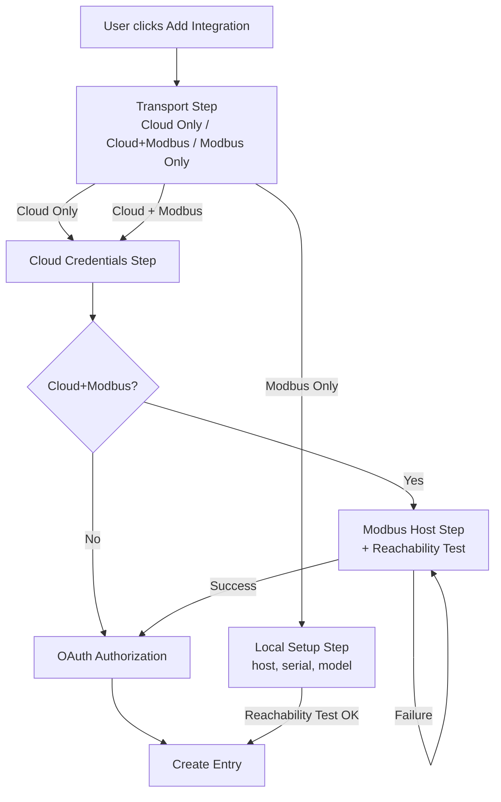
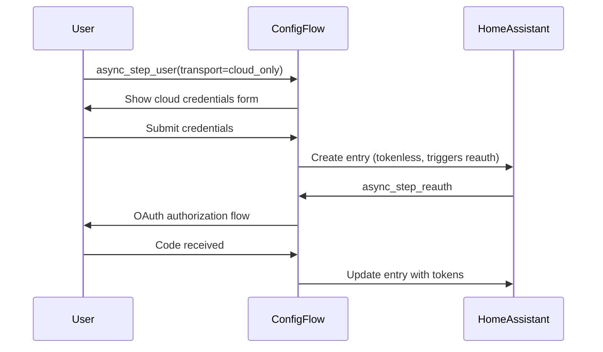
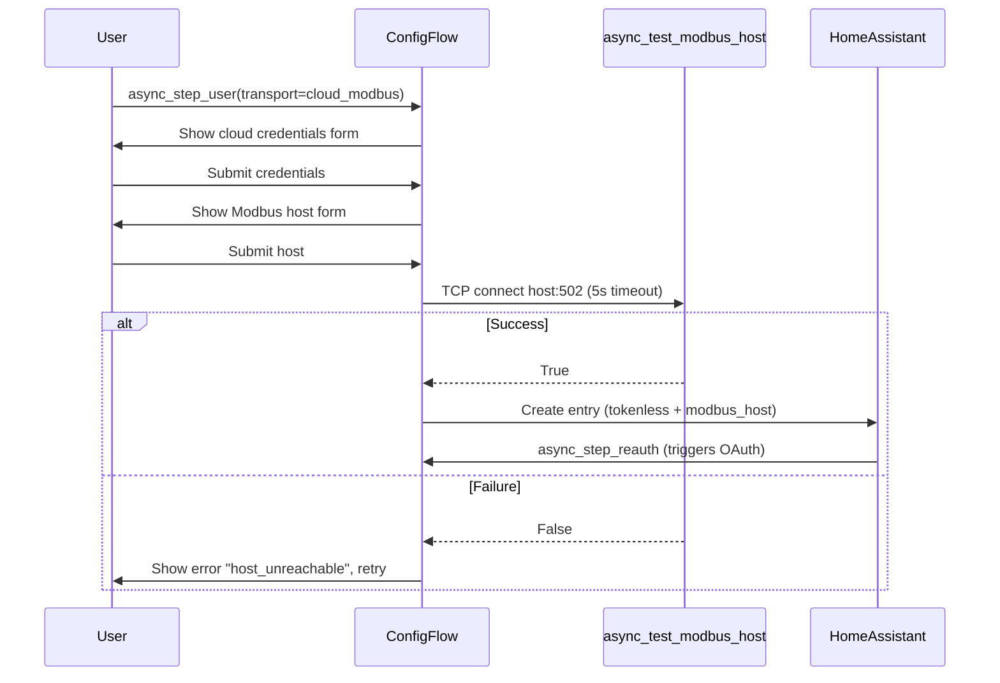
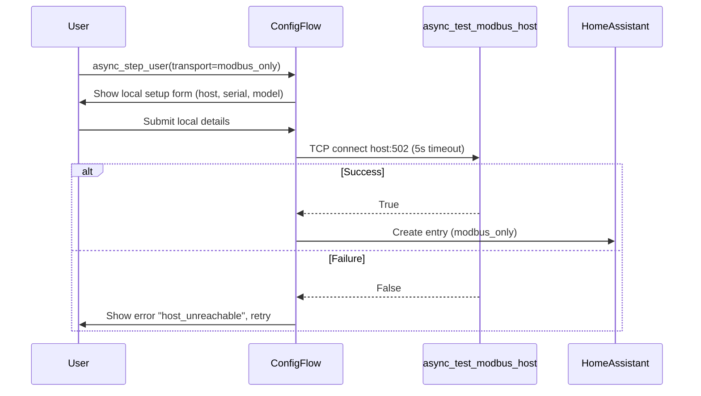
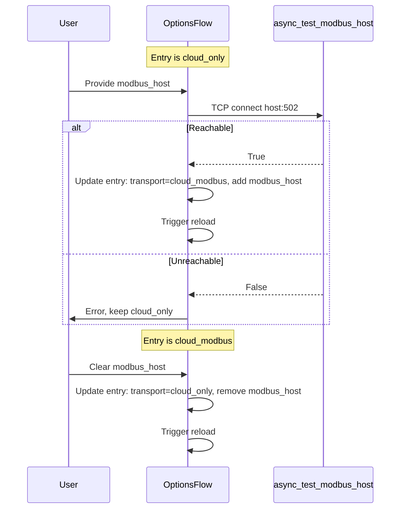

# Design Document: Transport Mode Selector

## Overview

This design adds an explicit transport-mode selector to the Sungrow iSolarCloud config flow so that users manually setting up the integration can choose between **Cloud Only**, **Cloud + Modbus** (hybrid), and **Modbus Only** connectivity before entering any credentials. The change introduces a new first step in the user-facing config flow, adapts the options and reconfigure flows, bumps the config-entry VERSION from 2 to 3 with a migration path, and adds a shared TCP reachability helper for Modbus host validation.

The actual hybrid data-path logic (coordinator merging cloud + Modbus readings) is explicitly **out of scope** — deferred to issue #217. This spec covers only the flow UI, data shape, migration, options/reconfigure adaptation, runtime branching stubs, and translations.

**Validates:** Requirements 1–12

---

## Architecture

### High-Level Flow Diagram



### Cloud Only Sequence



### Cloud + Modbus Sequence



### Modbus Only Sequence



### Options Flow Transport Switching



---

## Components and Interfaces

### Modified Files

| File | Changes | Requirements |
|------|---------|--------------|
| `custom_components/sungrow/const.py` | Add `TRANSPORT_CLOUD_ONLY`, `TRANSPORT_CLOUD_MODBUS` constants | Req 1 |
| `custom_components/sungrow/config_flow.py` | New `async_step_user` (transport selector), rename old user step to `async_step_cloud_credentials`, add `async_step_modbus_host`, add `async_step_local_setup`, adapt reconfigure for hybrid, bump VERSION to 3 | Req 2, 3, 8 |
| `custom_components/sungrow/helpers.py` | New file: `async_test_modbus_host(host, port=502, timeout=5) -> bool` | Req 12 |
| `custom_components/sungrow/__init__.py` | Extend `async_migrate_entry` (v2→v3), adapt runtime branching in `async_setup_entry` | Req 5, 11 |
| `custom_components/sungrow/strings.json` | Add transport step, modbus host step, and options flow translation keys | Req 10 |
| `custom_components/sungrow/translations/en.json` | Mirror all new keys from `strings.json` | Req 10 |

### New Helper: `async_test_modbus_host`

```python
# custom_components/sungrow/helpers.py

async def async_test_modbus_host(host: str, port: int = 502, timeout: float = 5.0) -> bool:
    """Test TCP reachability of a Modbus host.

    Attempts a TCP connection to host:port with the given timeout.
    Returns True if connection succeeds (socket is closed immediately).
    Returns False on any failure (timeout, refused, DNS error) without raising.
    """
```

**Validates:** Requirement 12

### Config Flow API Changes

| Method | Action |
|--------|--------|
| `async_step_user` | **Replaced**: now shows transport selector (3 choices). Branches to `async_step_cloud_credentials` or `async_step_local_setup`. |
| `async_step_cloud_credentials` | **New name** for old `async_step_user` logic (app key, secret, ID, gateway, redirect URI). Creates tokenless entry (or proceeds to modbus host step for hybrid). |
| `async_step_modbus_host` | **New**: text field for WiNet-S IP. Runs `async_test_modbus_host`. On success → creates entry or proceeds to OAuth. On failure → error + retry. |
| `async_step_local_setup` | **New**: collects host, serial, model for modbus_only path. Runs reachability test. On success → creates entry with `TRANSPORT_MODBUS_ONLY`. |
| `async_step_reconfigure` | **Modified**: for `cloud_modbus` entries, after credentials submission shows `async_step_modbus_host` before finalizing. |
| `SungrowOptionsFlow.async_step_init` | **Modified**: for `cloud_only` shows optional modbus_host field; for `cloud_modbus` shows host + clear option. |

### Constants Added to `const.py`

```python
TRANSPORT_CLOUD_ONLY = "cloud_only"
TRANSPORT_CLOUD_MODBUS = "cloud_modbus"
# TRANSPORT_MODBUS_ONLY already exists as "modbus_only"
```

**Validates:** Requirement 1

---

## Data Models

### Config Entry Data Shapes

#### Cloud Only (`transport = "cloud_only"`)

```python
{
    "transport": "cloud_only",
    "app_key": str,
    "app_secret": str,
    "app_id": str,
    "gateway": str,         # e.g. "Europe"
    "redirect_uri": str,
    "tokens": dict,         # OAuth tokens
    # NO modbus_host
}
```

**Validates:** Requirement 4.1

#### Cloud + Modbus (`transport = "cloud_modbus"`)

```python
{
    "transport": "cloud_modbus",
    "app_key": str,
    "app_secret": str,
    "app_id": str,
    "gateway": str,
    "redirect_uri": str,
    "tokens": dict,
    "modbus_host": str,     # WiNet-S IP/hostname
}
```

**Validates:** Requirement 4.2

#### Modbus Only (`transport = "modbus_only"`)

```python
{
    "transport": "modbus_only",
    "serial": str,
    "model": str,
    "modbus_host": str,
    # NO app_key, app_secret, app_id, gateway, redirect_uri, tokens
}
```

**Validates:** Requirement 4.3

### Migration: v2 → v3

```python
async def async_migrate_entry(hass: HomeAssistant, config_entry: ConfigEntry) -> bool:
    if config_entry.version == 1:
        # Existing v1→v2: scan_interval minutes → seconds
        old_interval = config_entry.options.get(CONF_SCAN_INTERVAL, 5)
        new_options = {**config_entry.options, CONF_SCAN_INTERVAL: old_interval * 60}
        hass.config_entries.async_update_entry(config_entry, options=new_options, version=2)

    if config_entry.version == 2:
        # v2→v3: back-fill transport field
        new_data = dict(config_entry.data)
        if CONF_TRANSPORT not in new_data:
            new_data[CONF_TRANSPORT] = TRANSPORT_CLOUD_ONLY
        hass.config_entries.async_update_entry(config_entry, data=new_data, version=3)

    return True
```

**Validates:** Requirement 5

### Runtime Branching (`async_setup_entry`)

```python
transport = entry.data.get(CONF_TRANSPORT)
if transport is None:
    _LOGGER.warning("Config entry %s missing CONF_TRANSPORT; defaulting to cloud_only", entry.title)
    transport = TRANSPORT_CLOUD_ONLY

if transport == TRANSPORT_MODBUS_ONLY:
    # Existing Modbus-only setup path (unchanged)
    ...
elif transport == TRANSPORT_CLOUD_MODBUS:
    # Cloud setup (same as cloud_only for now)
    # Log that hybrid mode is noted; actual Modbus wiring deferred to #217
    _LOGGER.info("Entry %s configured for cloud+modbus; Modbus wiring deferred to #217", entry.title)
    ...  # standard cloud coordinator setup
else:
    # cloud_only (default)
    ...  # standard cloud coordinator setup
```

**Validates:** Requirement 11

---

## Correctness Properties

*A property is a characteristic or behavior that should hold true across all valid executions of a system — essentially, a formal statement about what the system should do. Properties serve as the bridge between human-readable specifications and machine-verifiable correctness guarantees.*

### Property 1: Entry data shape matches transport mode schema

*For any* valid config entry data dictionary, if `transport` is `"cloud_only"` then the data contains all cloud credential fields (`app_key`, `app_secret`, `app_id`, `gateway`, `redirect_uri`) and does NOT contain `modbus_host`; if `transport` is `"cloud_modbus"` then the data contains all cloud credential fields AND `modbus_host`; if `transport` is `"modbus_only"` then the data contains `serial`, `model`, `modbus_host` and does NOT contain any cloud credential fields.

**Validates: Requirements 4.1, 4.2, 4.3**

### Property 2: v2→v3 migration correctly sets or preserves transport

*For any* version-2 config entry, after migration to v3: if `CONF_TRANSPORT` was absent, `entry.data["transport"]` equals `"cloud_only"`; if `CONF_TRANSPORT` was already `"modbus_only"`, it remains `"modbus_only"`. In both cases the entry version is 3.

**Validates: Requirements 5.2, 5.3, 5.4**

### Property 3: v1→v3 chained migration preserves semantics

*For any* version-1 config entry with a positive integer `scan_interval` option (in minutes), after full migration the entry is at version 3, the `scan_interval` option equals the original value multiplied by 60, and `entry.data["transport"]` is set (defaulting to `"cloud_only"` when absent).

**Validates: Requirements 5.5, 5.6**

### Property 4: Translation key parity

*For any* key path present in `strings.json` under the `config` or `options` sections, the same key path exists in `translations/en.json` with a non-empty English string value.

**Validates: Requirement 10.4**

### Property 5: Reachability test uses correct port and timeout

*For any* host string passed to `async_test_modbus_host`, the function attempts a TCP connection on port 502 with a timeout of 5 seconds.

**Validates: Requirements 12.1, 12.2**

### Property 6: Reachability test returns bool without exceptions

*For any* host string, `async_test_modbus_host` returns `True` when the TCP connection succeeds (and closes the socket) or `False` when it fails (timeout, refused, DNS error) — it never raises an unhandled exception to the caller.

**Validates: Requirements 12.3, 12.4**

---

## Error Handling

| Scenario | Handling | User Experience | Requirement |
|----------|----------|-----------------|-------------|
| Modbus host unreachable (timeout/refused) | `async_test_modbus_host` returns False | Error message on form: "The WiNet-S host is unreachable on port 502. Check the IP and ensure the dongle is online." User can correct and retry. | Req 3.4, 6.7, 8.5 |
| DNS resolution failure for host | Caught as `OSError` inside helper | Same UX as unreachable — shown as host_unreachable error. | Req 12.4 |
| Missing `CONF_TRANSPORT` at runtime | Default to `cloud_only` + warning log | Entry loads normally; user is not interrupted. Migration should have prevented this. | Req 11.4 |
| Migration from v1 with missing scan_interval | Default to 5 (minutes → 300 seconds) | Transparent — existing behaviour preserved. | Req 5.5 |
| OAuth failure after hybrid credentials step | Existing `_finish_error_result` path | Manual code entry form shown (unchanged behaviour). | — |
| Reconfigure modbus host fails reachability | Error on form, entry data unchanged | User can correct the address or cancel. | Req 8.5 |
| Options flow host switch fails reachability | Error on form, transport mode unchanged | Entry keeps its current mode; user informed. | Req 6.7 |

---

## Testing Strategy

### Test Framework

- **pytest** + **pytest-asyncio** (existing project setup)
- **Property-based testing**: [Hypothesis](https://hypothesis.readthedocs.io/) (already present in `.hypothesis/` directory)
- Minimum **100 iterations** per property test

### Unit Tests (Example-Based)

| Test | Validates |
|------|-----------|
| `test_step_user_shows_transport_selector` | Req 2.1 |
| `test_cloud_only_flow_creates_correct_entry` | Req 2.2, 4.1 |
| `test_cloud_modbus_flow_creates_correct_entry` | Req 2.3, 4.2 |
| `test_modbus_only_flow_creates_correct_entry` | Req 2.4, 4.3 |
| `test_modbus_host_step_shown_after_credentials_for_hybrid` | Req 3.1 |
| `test_zeroconf_prefills_host_in_hybrid_flow` | Req 3.2 |
| `test_host_unreachable_shows_error` | Req 3.4 |
| `test_host_reachable_proceeds` | Req 3.5 |
| `test_options_flow_cloud_only_shows_modbus_field` | Req 6.1 |
| `test_options_flow_switch_to_hybrid` | Req 6.3 |
| `test_options_flow_switch_back_to_cloud_only` | Req 6.5 |
| `test_options_flow_modbus_only_no_switch` | Req 6.6 |
| `test_zeroconf_unchanged` | Req 7.1, 7.2 |
| `test_reconfigure_cloud_modbus_shows_host_step` | Req 8.2 |
| `test_reconfigure_host_failure_shows_error` | Req 8.5 |
| `test_runtime_missing_transport_defaults_cloud_only` | Req 11.4 |

### Property-Based Tests (Hypothesis)

Each property test runs a minimum of 100 iterations. Tests are tagged with the property they validate.

| Test | Property | Tag |
|------|----------|-----|
| `test_entry_data_shape_per_transport_mode` | Property 1 | `Feature: transport-mode-selector, Property 1: Entry data shape matches transport mode schema` |
| `test_v2_to_v3_migration_transport_field` | Property 2 | `Feature: transport-mode-selector, Property 2: v2→v3 migration correctly sets or preserves transport` |
| `test_v1_to_v3_chained_migration` | Property 3 | `Feature: transport-mode-selector, Property 3: v1→v3 chained migration preserves semantics` |
| `test_translation_key_parity` | Property 4 | `Feature: transport-mode-selector, Property 4: Translation key parity` |
| `test_reachability_port_and_timeout` | Property 5 | `Feature: transport-mode-selector, Property 5: Reachability test uses correct port and timeout` |
| `test_reachability_returns_bool_no_exceptions` | Property 6 | `Feature: transport-mode-selector, Property 6: Reachability test returns bool without exceptions` |

### Integration Tests

| Test | Validates |
|------|-----------|
| `test_setup_entry_cloud_only_creates_cloud_coordinator` | Req 11.1 |
| `test_setup_entry_cloud_modbus_logs_deferred` | Req 11.2 |
| `test_setup_entry_modbus_only_creates_modbus_coordinator` | Req 11.3 |
| `test_full_migration_v1_through_v3` | Req 5.6 |

### Smoke Tests

| Test | Validates |
|------|-----------|
| `test_constants_defined` | Req 1.1, 1.2, 1.3 |
| `test_config_flow_version_is_3` | Req 5.1 |
| `test_translation_keys_exist` | Req 10.1, 10.2, 10.3 |
