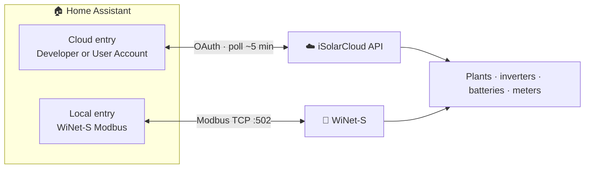

# Sungrow iSolarCloud Integration for Home Assistant

[![HACS][hacs-badge]][hacs-url]
[![CI][ci-badge]][ci-url]
[![codecov][codecov-badge]][codecov-url]
[![GitHub Release][release-badge]][release-url]
[![Contributor Covenant][coc-badge]][coc-url]

Custom component that integrates Sungrow inverters into Home Assistant — via the [official iSolarCloud OpenAPI](https://developer-api.isolarcloud.com/), the [unofficial user-account API](https://sungrow-hass.kroper.uk/local-modbus/#cloud-user-account-unofficial), or the WiNet-S dongle's [local Modbus TCP](https://sungrow-hass.kroper.uk/local-modbus/) interface. Powered by the [`sungrow-isolarcloud`](https://github.com/KRoperUK/pysolarcloud) library.

Set it up in the Home Assistant UI, pick your transport, and the integration discovers every plant on the account and maps your inverters, batteries, meters and WiNet-S onto Home Assistant's device tree — with the correct device/state classes so everything feeds straight into the Energy dashboard.

📖 **[Full documentation & setup guide → sungrow-hass.kroper.uk](https://sungrow-hass.kroper.uk/)**

## Transport modes

Choose one when you add the integration:

| Transport | Data source | Credentials | Control | Best for |
| --- | --- | --- | --- | --- |
| **Cloud (Developer Account via Official OpenAPI - Cloud Polling)** | iSolarCloud OpenAPI | Developer app (App Key/Secret/ID) | ✅ Full dispatch | Full plant sensors and battery/dispatch controls on the official API. |
| **Cloud (User Account via Unofficial API - Cloud Polling)** | iSolarCloud app/web API | Just email + password | ✅ Yes (experimental) | No developer app to register — sensors + dispatch via the unofficial API. |
| **Modbus (Local Polling)** | WiNet-S · TCP 502 | None | ✅ Active power limit (SG string) | Fast local reads without an API quota; keeps working when iSolarCloud is down. |

You can run **more than one** transport in parallel (e.g. a cloud entry and a local Modbus entry for the same inverter) — they stay as separate config entries and never merge state.



Your hardware maps onto Home Assistant as **one account → many plants → each plant's physical devices** (inverter, battery, meter, WiNet-S) nested underneath it. See [Sensors → Device grouping](https://sungrow-hass.kroper.uk/SENSORS/#device-grouping).

## Features

- **Three transport modes** — official OAuth OpenAPI, unofficial user-account login (no developer app required), or local Modbus over the WiNet-S. Pick one per config entry — you can run several side-by-side.
- **Auto-discovery** — finds every plant on the account (cloud), and offers a **Discovered** card when a WiNet-S dongle appears on your LAN (local). Cloud OAuth entries with more than one plant open a **plant picker** so you choose which plants to integrate.
- **Guided Modbus wizard** — manual local setup scans the LAN, reads the inverter model + serial straight from Modbus registers, and confirms comms before creating the entry, so you rarely have to type more than an IP.
- **Rich sensors** — power, energy, battery SOC, per-string DC, per-phase AC and more, classified with the correct `device_class` / `state_class` so they land in the Energy dashboard automatically.
- **Device health & diagnostics** — per-device **Fault** (problem) + **Connectivity** (online/offline) binary sensors, human-readable operating status as a reason, model/serial/manufacturer on every device card, plus opt-in per-device diagnostic sensors (inverter temperature, MPPT V/I, grid frequency, WLAN signal).
- **Device grouping** — inverter, battery, meter and WiNet-S readings are grouped under the physical device that reports them, nested beneath the plant. Multi-inverter aggregates stay on the plant device. Entity IDs and history are unchanged.
- **Plant health & tariffs** — plant-wide alarm/fault counts, nameplate power, and your configured import/export tariffs, surfaced as sensors on the plant device.
- **Battery dispatch (`sungrow.set_battery_mode`)** — a single **Battery Mode** select (Self-consumption / Force charge / Force discharge / Stop) plus charge/discharge power, SOC limits, forced charging and battery-first mode. Battery-only controls are hidden on PV-only plants so a battery-less inverter can't be forced into External-EMS mode.
- **Scheduled forced charge/discharge windows** — two configurable daily windows (start/end in local time, wrap-over-midnight supported) that automatically enter Force charge or Force discharge for the window and revert afterwards.
- **Safer dispatch (auto-revert)** — **Forced Dispatch Duration** (default 60 min) auto-reverts a forced mode after the set time, surviving restarts. Set to 0 for unbounded commands (not recommended).
- **Grid / export limiting** — number + select entities for export limit (power and %), active-power limiting, and reactive-power regulation (Off / Power Factor / Q(t) / Q(P) / Q(U)). Available on PV-only plants too.
- **Custom measure points** — add any iSolarCloud point ID via the options flow (`point_id=code` pairs) to surface hardware-specific points that aren't in the default map.
- **Resilient polling** — rides out brief network/API blips (15-min grace window) instead of flapping to *unavailable*, and auto-backs-off when iSolarCloud rate-limits the account (up to a 1-hour interval, then recovers).
- **Guided repairs** — whitelist (E918/E919) and rate-limit (E998/E999) rejections, unexpectedly-stopped dispatch keepalives, and dispatch commands the inverter didn't actually apply, surface as actionable Home Assistant **Repairs**.
- **Historical backfill (`sungrow.backfill`)** — service to import iSolarCloud historical data into Home Assistant long-term statistics so the History and Energy dashboards are populated immediately after setup.
- **Token persistence + re-auth** — refreshed tokens are saved automatically so entities stay available across restarts. If credentials expire, Home Assistant prompts you to re-authorize in place (no delete + re-add). A **`sungrow.refresh_tokens`** service is available for support triage.
- **Configurable polling** — tune the poll interval via the options flow (minimum 10 s; default 5 min for cloud, 30 s for local Modbus).

## Use cases

Typical things people use this integration for:

- **Monitor your solar system in Home Assistant** — live generation, house consumption, grid import/export and battery state of charge as sensors, with the correct device/state classes so they feed straight into the **Energy dashboard** and long-term statistics.
- **Time-of-use battery control** — combine the dispatch **number**/**select** entities with automations to charge the battery from the grid when electricity is cheap and discharge it during peak-price periods (see [Example automations](#example-automations)).
- **Force-charge before high demand** — top the battery up ahead of a known heavy-usage window (e.g. before cooking or an EV charge session) using the forced-charging entities.
- **EV charger & meter visibility** — enable per-device sensors to surface EV charger power/energy and meter readings alongside the plant data.
- **Alerting** — notify on low battery SOC, a plant going unavailable, or a fault, using standard Home Assistant automations on the sensors this integration creates.

## Installation

### HACS (Recommended)

[![Open HACS Repository][hacs-my-badge]][hacs-my-url]

Or manually:

1. Open **HACS** → **Integrations**.
2. Click the three-dot menu → **Custom repositories**.
3. Add `https://github.com/KRoperUK/sungrow-hass` as an **Integration**.
4. Search for **Sungrow iSolarCloud** and install.
5. Restart Home Assistant.

### Manual

1. Download the [latest release][release-url].
2. Copy `custom_components/sungrow` into your Home Assistant `custom_components` directory.
3. Restart Home Assistant.

## Configuration

The full setup guide with per-transport screens is at [sungrow-hass.kroper.uk/installation](https://sungrow-hass.kroper.uk/installation/). The short version:

1. **Settings → Devices & Services → Add Integration → Sungrow iSolarCloud.**
2. **Pick a transport mode:**
   - **Cloud (Developer Account via Official OpenAPI - Cloud Polling)** — enter your **Gateway region**, **App Key**, **App Secret**, **App ID** and Redirect URI, then authorize in your browser. Register an application on the [iSolarCloud Developer Portal](https://developer-api.isolarcloud.com/) first (with **OAuth 2.0** enabled). New apps take up to a week to be approved by Sungrow.
   - **Cloud (User Account via Unofficial API - Cloud Polling)** — enter the **email**, **password** and **region** you use for the iSolarCloud app. No developer app required. See [caveats](https://sungrow-hass.kroper.uk/local-modbus/#cloud-user-account-unofficial).
   - **Modbus (Local Polling)** — the wizard scans your LAN for WiNet-S dongles, reads the model + serial from Modbus, and creates a local entry. If your dongle isn't discoverable, choose **Enter IP manually** and type its address. See [Local Modbus (WiNet-S)](https://sungrow-hass.kroper.uk/local-modbus/).
3. **Multi-plant cloud accounts** get a plant picker after authorization so you choose which plants to integrate.

### Options

After setup, **Settings → Devices & Services → Sungrow → Configure** offers, depending on the transport:

- **Polling interval** — minimum 10 s. Default 5 min (cloud) or 30 s (local Modbus).
- **Extra measure points** — comma-separated `point_id=code` pairs to request additional iSolarCloud points not in the default map (e.g. an EV charger).
- **Create per-device sensors** *(cloud)* — polls each discovered device (EV charger, meter, extra battery) for its own realtime points; adds a call per device type per poll.
- **Scheduled forced-charge / forced-discharge windows** — two daily windows (start/end HH:MM local time, wrap-over-midnight allowed) that automatically enter **Force charge** or **Force discharge** for the window and revert afterwards. Leave times blank to disable a slot.
- **Modbus daily-yield debug** *(local)* — exposes the raw daily-yield register dump on the sensor attributes; off by default.

### Changing region or credentials

Picked the wrong gateway region, or rotated your API secret? Use **Settings →
Devices & Services → Sungrow → ⋮ → Reconfigure** to update the region, App Key,
App Secret, or redirect URI without deleting and re-adding the integration (your
entity history is kept). You'll be asked to authorize again in the browser, since
new credentials or a new region need fresh tokens. The App ID stays fixed.

### Services

- **`sungrow.set_battery_mode`** — set the plant Battery Mode (Self-consumption / Force charge / Force discharge / Stop). Optional per-call `duration_minutes` overrides the Forced Dispatch Duration for one command.
- **`sungrow.backfill`** — import historical iSolarCloud data into Home Assistant long-term statistics so History and Energy dashboards are populated immediately after setup.
- **`sungrow.refresh_tokens`** — force an OAuth token refresh on the addressed cloud entry (or every loaded cloud entry). For support triage when tokens appear stuck.

### Removing the integration

Go to **Settings → Devices & Services → Sungrow iSolarCloud → ⋮ → Delete**. This
removes the config entry and all of its entities and devices; no files are left
behind (uninstall the repository from HACS separately if you also want to remove
the code). Your iSolarCloud account and developer application are unaffected.

### Sensor mapping

Not sure which sensor corresponds to which value in the iSolarCloud app? See [Sensor mapping](https://sungrow-hass.kroper.uk/SENSORS/) or [`docs/SENSORS.md`](docs/SENSORS.md).

## How data updates

- **Cloud transports** poll iSolarCloud on a fixed interval (default **5 minutes**, minimum 10 s) using one data update coordinator **per plant**. Every sensor for a plant refreshes together on each poll. Lower intervals update sooner but use more of your API quota (the free developer plan allows ~2000 calls/hour); enabling per-device sensors adds a call per device type each poll.
- **Local Modbus** polls the WiNet-S directly on TCP 502 (default **30 s**, minimum 10 s). No API quota; keeps working when iSolarCloud is unreachable.
- **Availability.** Entity state reflects the last successful poll. A single failed poll (network/API blip) no longer flips everything to *unavailable* — the integration keeps serving the last-known values through a short grace period (~15 minutes) and retries on the next interval. Only a sustained outage marks entities unavailable; no restart is needed to recover.
- **Rate limiting.** If iSolarCloud rejects a poll for exceeding the call quota (E998/E999), the integration automatically **backs off** — doubling the effective interval up to a 1-hour cap — and raises a Home Assistant **Repair** suggesting a higher polling interval. It returns to your configured interval once the quota recovers.
- **Authentication.** Access tokens are refreshed automatically and the rotated tokens are persisted, so entities stay available across restarts. If your credentials are revoked or expire, the integration triggers a **re-authorization** prompt rather than silently failing.
- **Dispatch controls are write-only.** The dispatch **number**/**select** entities send commands to the inverter; iSolarCloud does not report their current value back, so they act as controls (their state is not polled). Setting *Charge* or *Discharge* also switches Energy Management Mode to Compulsory (Forced) so the inverter actually follows the command; *Stop* restores Self-consumption. While actively charging/discharging, a background EMS heartbeat is kept running.

## Example automations

Entity IDs depend on your device name — check **Settings → Devices & Services → Sungrow** for the exact IDs. The examples below assume a device called `inverter`.

**Charge the battery overnight (cheap tariff), then return to self-consumption:**

```yaml
automation:
  - alias: "Battery: charge overnight"
    triggers:
      - trigger: time
        at: "00:30:00"
    actions:
      - action: number.set_value
        target:
          entity_id: number.inverter_charge_discharge_power
        data:
          value: 3000
      - action: sungrow.set_battery_mode
        data:
          mode: force_charge
          duration_minutes: 300   # auto-revert after 5 hours
          entity_id: select.inverter_battery_mode

  - alias: "Battery: self-consumption at peak start"
    triggers:
      - trigger: time
        at: "05:30:00"
    actions:
      - action: sungrow.set_battery_mode
        data:
          mode: self_consumption
          entity_id: select.inverter_battery_mode
```

**Notify when the battery gets low:**

```yaml
automation:
  - alias: "Battery: low SOC alert"
    triggers:
      - trigger: numeric_state
        entity_id: sensor.my_plant_battery_state_of_charge
        below: 15
    actions:
      - action: notify.notify
        data:
          message: "Home battery is below 15%."
```

> Selecting **Charge**/**Discharge** (or setting charge/discharge power) automatically starts the EMS heartbeat; selecting **Stop** ends it.

## Supported devices & regions

- **Regions / gateways:** Europe, International, China, and Australia. Pick the one matching the account you registered your developer application under.
- **Devices:** grid-tied inverters, hybrid inverters, and energy storage systems (ESS / batteries) that appear in your iSolarCloud account. Sensors are created for whatever data points iSolarCloud returns for your plant.
- **Dispatch / control:** number and select entities are created for inverter / ESS devices that support External EMS control. **Battery** controls (charge/discharge command & power, SOC limits, forced charging, battery-first mode) only appear when the plant actually has a battery/ESS — on a **PV-only** plant they are hidden, since dispatching charge/discharge on a battery-less inverter can force it into External-EMS mode and suppress generation. Non-battery controls (export limiting, active-power limiting) remain available on PV-only plants.

## Limitations

- **Cloud-only.** All data comes from the iSolarCloud cloud API — there is no local polling. If iSolarCloud is unreachable, or your account/plan loses API access, entities become unavailable.
- **API quota.** The free developer plan allows ~2000 calls/hour; keep the polling interval sensible, especially with many sensors.
- **Dispatch needs compatible firmware and plan.** External EMS / parameter setting requires an inverter and iSolarCloud plan that permit it. Where unsupported, dispatch entities may error on write.
- **Developer app approval.** New iSolarCloud developer applications must be approved by Sungrow (with OAuth 2.0 enabled) before authorization works — this can take up to a week.

## Troubleshooting

Having trouble authorizing, or entities showing as *unavailable*? See the
[Troubleshooting guide](docs/TROUBLESHOOTING.md) — it covers the common
"Invalid authentication" / "Operation failed" setup errors and the
unavailable-after-reboot problem.

## Development

See [CONTRIBUTING.md](CONTRIBUTING.md) for full developer setup and guidelines.
By participating, you agree to follow our [Code of Conduct](CODE_OF_CONDUCT.md).

### Running Tests

```bash
pip install -r requirements_test.txt
ruff check custom_components/
ruff format --check custom_components/
pytest
```

### Live Integration Testing

To run live tests against the real iSolarCloud API:

1. Copy `.env.example` to `.env` and fill in your credentials:
   ```env
   SUNGROW_APPKEY="your_app_key"
   SUNGROW_APPSECRET="your_app_secret"
   SUNGROW_APP_ID="your_app_id"
   ```

2. Run the live tests:
   ```bash
   pytest -m live
   ```

   > Live tests are automatically skipped when credentials are not set.

### Logo & icon

The integration ships `icon.png` / `logo.png` under `custom_components/sungrow/`.
For the brand images to appear in the Home Assistant UI's official brand system
(and on [brands.home-assistant.io](https://brands.home-assistant.io)), the
`sungrow` domain also needs a PR to the
[home-assistant/brands](https://github.com/home-assistant/brands) repository.

### Security

Found a security issue? Please follow the disclosure process in
[SECURITY.md](SECURITY.md) rather than opening a public issue.

## Support

Found a bug or have a feature request? [Open an issue][issues-url].

---

[hacs-badge]: https://img.shields.io/badge/HACS-Custom-41BDF5.svg
[hacs-url]: https://hacs.xyz
[ci-badge]: https://img.shields.io/github/actions/workflow/status/KRoperUK/sungrow-hass/ci.yml?branch=main&label=CI
[ci-url]: https://github.com/KRoperUK/sungrow-hass/actions/workflows/ci.yml
[codecov-badge]: https://img.shields.io/codecov/c/github/KRoperUK/sungrow-hass/main
[codecov-url]: https://codecov.io/gh/KRoperUK/sungrow-hass
[release-badge]: https://img.shields.io/github/v/release/KRoperUK/sungrow-hass
[release-url]: https://github.com/KRoperUK/sungrow-hass/releases/latest
[coc-badge]: https://img.shields.io/badge/Contributor%20Covenant-2.1-4baaaa.svg
[coc-url]: CODE_OF_CONDUCT.md
[hacs-my-badge]: https://img.shields.io/badge/HACS-Install-41BDF5?logo=homeassistant&logoColor=white
[hacs-my-url]: https://my.home-assistant.io/redirect/hacs_repository/?owner=KRoperUK&repository=sungrow-hass&category=integration
[issues-url]: https://github.com/KRoperUK/sungrow-hass/issues
