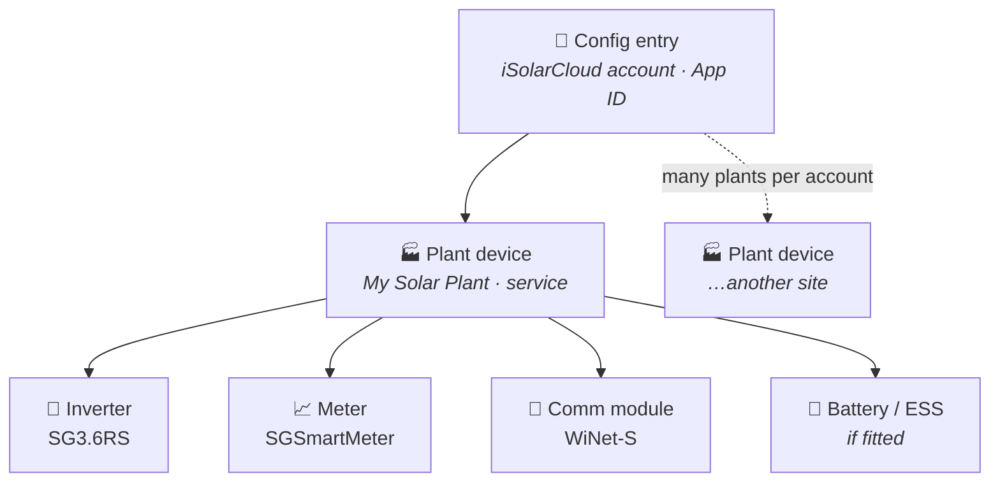

# Sungrow iSolarCloud sensor mapping

The integration models each iSolarCloud plant as a Home Assistant device, with the plant's physical devices (inverter, battery, meter, WiNet-S) nested underneath it. It adds a sensor for every realtime measure point the plant returns and **groups each one under the physical device it belongs to** when that device can be identified (see [Device grouping](#device-grouping)). The point codes come from the iSolarCloud API; this guide maps the most common ones to the values shown in the iSolarCloud app.

> Not every inverter / battery / meter returns every point. The available set depends on your model, firmware, and region. If a value you expect is missing, see [Adding extra measure points](#adding-extra-measure-points) below.

## Device grouping

The integration mirrors your real hardware in Home Assistant's device tree: **one iSolarCloud account maps to one config entry, which holds one *plant* device per plant, and each physical device (inverter, battery/ESS, meter, WiNet-S) is nested under its plant** via `via_device`.



The **plant** is a *service* device (no physical hardware of its own) that anchors the tree. Each plant reading is then attached to the physical device it describes — inverter power/yield to the **inverter**, state-of-charge and battery flows to the **battery/ESS**, grid and import/export readings to the **meter**. A reading is only moved onto a device when the plant has exactly **one** device of that type; genuine plant aggregates (e.g. *Total Active Power* on a two-inverter site) and household-load or forecast readings stay on the plant device. Grouping is automatic and changes only *where* entities appear — **entity IDs and history are unchanged**, so existing automations and dashboards keep working.

!!! info "Why the device list looks flat"
    Home Assistant lists **every** device on a config entry in one flat list, so the plant appears
    alongside the inverter/meter/comm module rather than visually nested. The parent link is still
    there: open a device and you'll see **“Connected via *&lt;plant&gt;*”**, and the topology drives
    area assignment. Nothing to fix — that's just how HA renders the list.

## Common dashboard values

| iSolarCloud app / diagram | Likely sensor (code) | Notes |
|---|---|---|
| Solar Production | `total_active_power` or `inverter_ac_power` | Total AC power from the inverter(s). |
| Battery Usage | `total_field_energy_storage_active_power` (aliased as **Battery Power**) | Positive = charging, negative = discharging. |
| Battery Charge % | `battery_level_soc`, `battery_soc`, `total_field_soc`, or `energy_storage_soc_ems` | Depends on your system topology. |
| Load | `load_power` or `total_load_active_power` | Household consumption. |
| Usage from Grid | `grid_active_power` or `grid_active_power_ems` | Positive = importing, negative = exporting. |
| Daily Solar Yield | `daily_yield` / `inverter_daily_yield` / `daily_pv_yield_ems` | Resets at midnight local time. |
| Daily Feed-in | `feed_in_energy_today` / `daily_feed_in_energy_pv` | Energy exported to the grid today. |
| Daily Import | `energy_purchased_today` / `total_purchased_energy` | Energy imported from the grid today. |

## Battery-specific points

The following codes are surfaced for many hybrid inverters / battery systems:

- `total_field_energy_storage_active_power` → **Battery Power** (kW)
- `total_field_maximum_rechargeable_power` → **Battery Max Charge Power**
- `total_field_maximum_dischargeable_power` → **Battery Max Discharge Power**
- `total_field_chargeable_energy` → **Battery Chargeable Energy**
- `total_field_dischargeable_energy` → **Battery Dischargeable Energy**
- `daily_field_charge_capacity` → **Battery Daily Charge Capacity**
- `daily_field_discharge_capacity` → **Battery Daily Discharge Capacity**

If you need separate **Battery Charge Power** and **Battery Discharge Power** sensors (rather than a single signed value), you can request the additional point IDs via the integration options once you know them for your hardware. See the next section.

## Adding extra measure points

Some point IDs are not included in the default request because they vary by inverter model or firmware. The integration can request any point ID you provide:

1. Open **Settings → Devices & services → Sungrow iSolarCloud → Configure**.
2. In **Extra measure points**, enter a comma-separated list of `point_id=code` pairs, for example:
   ```
   99999=battery_charge_power, 99998=battery_discharge_power
   ```
3. The point IDs must be numeric; the codes can be any descriptive name you like.
4. Save — the integration will reload and create sensors for those codes.

You can find the actual point IDs for your hardware by:

- Checking the **Common Measuring Point Enumeration** in the iSolarCloud Developer Portal.
- Running a diagnostics dump from the device page in Home Assistant.
- Using community tools such as [GoSungrow](https://github.com/MickMake/GoSungrow) to list points for your plant.

### Recommended measure points (from the official docs)

The official iSolarCloud measuring-point catalogs — also served by the [mcp-isolarcloud](https://github.com/KRoperUK/mcp-isolarcloud) docs server — list the point IDs, names and units per device type. The integration ships a **grounded catalog of ~640 documented points** (all 17 device types), so pasting the matching `point_id=code` pairs into **Extra measure points** gives nicely-named, correctly-classified sensors.

**Classification is automatic.** Device and state class are inferred from the API-reported unit, and — new in this release — from the documented point when the API reports *no* unit. So the dimensionless points (SOC, SOH, power factor, performance ratio, charge/discharge cycle counts) now classify correctly instead of showing up as plain text, and status points (EV charger status, inverter operating state) render as human-readable text via a `SensorDeviceClass.ENUM`. Energy points feed the Energy dashboard automatically. The friendly name comes from the point ID even if you pick your own `code`, so you don't have to memorise the exact code.

**Battery** ([Common Battery Measuring Points](https://github.com/KRoperUK/mcp-isolarcloud)):
```
58604=battery_level, 58605=battery_soh, 58601=battery_voltage, 58602=battery_current, 58603=battery_temperature, 58606=battery_total_charge_energy, 58607=battery_total_discharge_energy
```

**EV charger** (Common Charger Measuring Points):
```
33708=ev_charger_power, 33723=ev_charger_max_power, 33716=ev_charger_status
```

**Energy meter** (Common Energy Meter Measuring Points):
```
8030=meter_forward_active_energy, 8031=meter_reverse_active_energy, 8062=meter_daily_forward_active_energy, 8063=meter_daily_reverse_active_energy, 8018=meter_active_power, 8014=meter_power_factor, 8026=meter_apparent_power, 8064=meter_frequency
```

**Energy storage inverter** (Common Energy Storage Inverter Measuring Points):
```
13126=battery_charge_power, 13150=battery_discharge_power, 13141=battery_soc, 13142=battery_soh, 13034=battery_total_charge_energy, 13035=battery_total_discharge_energy, 13119=load_power, 13121=feed_in_power, 13149=purchased_power, 13146=inverter_operating_status
```

**EMS device** (Common EMS Device Measuring Points):
```
24625=ems_storage_power, 24629=ems_storage_soc, 24626=ems_grid_power, 24624=ems_pv_power, 24631=ems_active_load, 24622=ems_total_charge, 24623=ems_total_discharge
```

**Microinverter** (Common Microinverter Measuring Points):
```
51303=micro_active_power, 51302=micro_total_yield, 51346=micro_yield_today, 51307=micro_power_factor, 51301=micro_running_status
```

Combiner-box, PCS, CMU/BSC, LC, environment-monitoring and communications catalogs are covered too — browse them via the docs server and add any `point_id=code` pair you need. Point IDs are consistent per device *type* but not guaranteed across every model/firmware, so confirm against your hardware if a point is missing.

## Device-level diagnostic & health entities

Alongside the plant sensors, the integration adds **diagnostic** entities that describe the state of the hardware itself. These are grouped under each device's card (enriched with its **model**, **serial number** and **manufacturer**) and default to the *Diagnostic* entity category. The commissioning date is exposed as an attribute on the device's Connectivity sensor.

**Per-device binary sensors** (created for every discovered device with a UUID):

| Entity | Device class | Meaning |
|---|---|---|
| Fault | `problem` | On when the device reports a fault or alarm (`dev_fault_status`); Off when normal. Exposes an `operating_status` attribute with a human-readable reason for inverter/ESS devices (e.g. *Shut down due to faults*, *Low insulation resistance*, *Running with alarm*), so you see *why* — available even without per-device sensors enabled. |
| Connectivity | `connectivity` | On = online, Off = offline (`dev_status`). Exposes the commissioning/grid-connection date as an attribute. |

**Per-device diagnostic sensors** — surfaced when **Create per-device sensors** is enabled (Configure → options), polled per device type from the documented measure-point catalog:

- **Inverter:** operating status, total DC power, internal temperature, grid frequency, array insulation resistance, MPPT 1–3 voltage/current, **per-string DC voltage & current** (strings 1–8, for array analysis), and grid-side health — **per-phase voltage & current** (A/B/C), reactive & apparent power, power factor, DC bus voltage, on-grid running time, negative-voltage-to-ground and AFCI fault count. (Points a given model doesn't report — e.g. strings beyond what it has — are simply skipped.)
- **Battery / ESS** (hybrid systems): battery level (SOC), state of health, voltage, current, temperature, and total charge/discharge energy, plus cell/module health — **max/min cell voltage** (imbalance), **max/min module temperature** (thermal spread), operation status, DC-contactor status and fault-module ID. Health-oriented points (voltage, current, temperature, SOH, and all the cell/module health points) are marked *Diagnostic*; SOC and charge/discharge energy stay primary sensors for dashboards.
- **Energy meter:** instantaneous active / reactive / apparent power, power factor, grid frequency, per-phase voltage & current, and forward/reverse (import/export) active energy. (A meter that only reports energy — e.g. the SGSmartMeter — surfaces just those.)
- **Communication module (WiNet-S):** WLAN signal strength and wireless signal strength.

## Plant health & tariffs

Alongside the realtime measure points, the integration surfaces a few fields from the plant record itself (refreshed periodically, attached to the plant device):

| Sensor | Source | Notes |
|---|---|---|
| Alarm Count / Fault Count | `alarm_count` / `fault_count` | Plant-wide counts, *Diagnostic* — a quick "is anything wrong?" at the plant level. |
| Installed Power | `install_power` | Nameplate power of the plant (W). |
| Import Price / Export Price | `ps_consumption_power_price_kwh` / `ps_feedin_power_price_kwh` | Your configured tariffs, in the plant's currency per kWh (e.g. `GBP/kWh`) — handy for cost automations. |

Fields your plant doesn't report are simply not created.

## Dispatch / control entities

If your inverter / ESS supports parameter configuration, the integration also creates **Number** and **Select** entities per plant for dispatch control. The **Battery?** column marks the controls that only appear when the plant actually has a battery/ESS device — on a **PV-only** plant they are hidden (see the warning below):

| Entity | Parameter | Range / options | Battery? |
|---|---|---|---|
| Charge/Discharge Command | `charge_discharge_command` | Stop / Charge / Discharge | ✅ |
| Charge/Discharge Power | `charge_discharge_power` | 0 W – device rating (fallback 5000 W) | ✅ |
| SOC Upper Limit | `soc_upper_limit` | 70–100 % | ✅ |
| SOC Lower Limit | `soc_lower_limit` | 0–50 % | ✅ |
| Forced Charging | `forced_charging` | Disable / Enable | ✅ |
| Forced Charge Target SOC (Window 1) | `forced_charging_target_soc_1` | 0–100 % | ✅ |
| Forced Charge Target SOC (Window 2) | `forced_charging_target_soc_2` | 0–100 % | ✅ |
| Battery First Mode | `battery_first` | Disable / Enable | ✅ |
| Export Limitation | `feed_in_limitation` | Disable / Enable | — |
| Export Limit (Power) | `feed_in_limitation_value` | 0 W – device rating | — |
| Export Limit (%) | `feed_in_limitation_ratio` | 0–100 % | — |
| Active Power Limiting | `limited_power_switch` | Disable / Enable | — |
| Active Power Limit | `active_power_limit_ratio` | 0–100 % | — |
| Reactive Power Mode | `reactive_power_regulation_mode` | Off / Power Factor / Q(t) / Q(P) / Q(U) | — |
| Reactive Power Ratio Q(t) | `q_t` | −60–60 % | — |
| Power Factor | `pf` | −1 to 1 | — |
| Forced Dispatch Duration | *(local)* | 0–1440 min (0 = off) | ✅ |

The power sliders (charge/discharge power, export limit power) are sized to the device's **rated power**, parsed from its model code (e.g. `SG3.6RS` → 3.6 kW), falling back to 5000 W when the rating can't be derived.

The **reactive-power** controls work together: set **Reactive Power Mode** first, then the relevant value — **Power Factor** only takes effect in *Power Factor* mode, and **Reactive Power Ratio Q(t)** only in *Q(t)* mode. These are grid-quality controls and are available on PV-only plants too (they aren't battery-gated).

When you set **Charge/Discharge Command** to *Charge* or *Discharge*, the integration:

1. Switches **Energy Management Mode** (param `10003`) to **Compulsory / Forced** — required for the command to take effect (writing charge/discharge alone is accepted by the device but ignored while the plant stays in Self-consumption).
2. Starts the External EMS heartbeat (param `10017`) every 60 seconds.

Selecting **Stop** restores Self-consumption mode and turns the heartbeat off. If you remove the dispatch entities, the heartbeat is also stopped.

> **Auto-revert (safety).** Set **Forced Dispatch Duration** to a number of minutes and a forced *Charge*/*Discharge* automatically reverts to **Stop** after that long — so a forced command can't silently persist and curtail your solar (the [#148](https://github.com/KRoperUK/sungrow-hass/issues/148) footgun). The countdown survives a Home Assistant restart (if it expires while HA is down, the command reverts on startup). Leave it at **0** to keep the legacy behaviour (a forced command stays until you change it). It's a local control — it writes nothing to the inverter itself.

> Dispatch support requires the correct iSolarCloud API plan and firmware. The integration will only create dispatch entities if it can discover a compatible inverter or ESS device for the plant.

> **⚠️ Battery controls are hidden on PV-only plants.** Charge/discharge, SOC, forced-charging and battery-first controls only appear when the plant has a battery/ESS. Sending a charge/discharge command to a **battery-less** inverter can force it into External-EMS mode and **suppress generation**, so these controls are withheld on PV-only systems. Export- and active-power-limiting controls remain available.

## EV charger support

If your EV charger appears as a separate device in iSolarCloud, request its points via the **Extra measure points** option (or enable **per-device sensors**, which polls each discovered device). The documented charger point IDs are listed under [Recommended measure points](#recommended-measure-points-from-the-official-docs) above; verified additions from other charger models are welcome.

## Still missing a sensor?

1. Enable debug logging for the integration:
   ```yaml
   logger:
     logs:
       custom_components.sungrow: debug
   ```
2. Reload the integration and look for the raw realtime data in the logs.
3. Find the point ID / code for the value you want and add it via the options, or open an issue with the redacted raw data.
