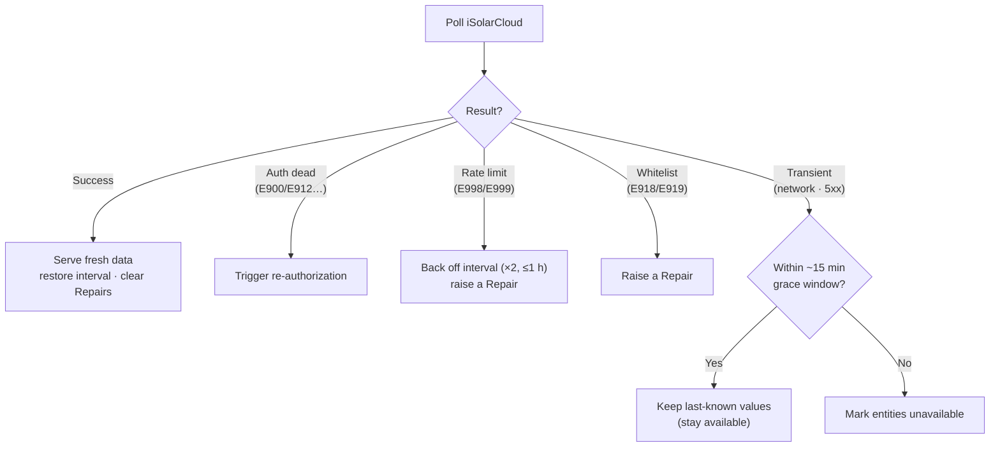

# Troubleshooting

This page covers the most common problems reported with the Sungrow iSolarCloud
integration. Please read it before opening an issue.

## Enable debug logging

Add this to your `configuration.yaml`, restart Home Assistant, and reproduce the
problem:

```yaml
logger:
  default: info
  logs:
    custom_components.sungrow: debug
    pysolarcloud: debug
```

When sharing logs, **redact your App Key, App Secret, and any tokens.**

---

## "Invalid authentication" / "Operation failed" during setup

These are almost always caused by the App ID, redirect URI, or API approval, not
by the integration itself.

1. **Use only the numeric App ID.** In the iSolarCloud developer portal the
   application URL looks like `.../editApplication?id=1234`. Enter **`1234`** in
   the *App ID* field — not the whole URL.
2. **Your API access must be approved by Sungrow.** New applications sit in
   *pending approval* and authorization will fail until approved. This commonly
   takes about a week. You cannot proceed before approval.
3. **Enable OAuth 2.0** for your application in the developer portal.
4. **The redirect URI must match exactly** in three places: the developer portal,
   the value you enter in Home Assistant, and what gets used during the token
   exchange. Scheme (`http`/`https`), host/IP, and path must all match.
   - Local: `http://homeassistant.local:8123/api/sungrow_hass/callback`
   - Nabu Casa: `https://<your-id>.ui.nabu.casa/api/sungrow_hass/callback`
5. **The hub is created first, then you authorize it.** After you submit your
   credentials Home Assistant creates the hub and prompts you to *authorize* it
   (a reconfigure/authorize notification on the integration). Creating the hub
   first registers the `/api/sungrow_hass/callback` endpoint, so the redirect
   resolves even on a brand-new install (this is the fix for the *404 on the
   callback during a first-time setup*). Open the prompt and a *Waiting for
   authorization* screen appears; log in and approve the app and the code is
   captured automatically.
6. **Manual entry is the fallback.** If the redirect does not complete (for
   example the callback endpoint returns an error, or iSolarCloud strips the
   `flow_id` query parameter), the screen automatically switches to an *Enter
   Authorization Code* form after a short wait. Paste the `code` value from the
   URL bar there — or paste the whole redirect URL and the integration extracts
   the code for you. Make sure the base redirect URI still matches the developer
   portal exactly. Even once you're on this form, **finishing the login in your
   browser still completes setup automatically** — a redirect that lands late is
   no longer lost.

---

## Entities go "unavailable" after restarting / updating Home Assistant

**This is handled automatically by current versions.** Very old versions
(pre-0.3.0) did not persist the rotated refresh token, so after a restart the
stored token was already invalid and every entity went unavailable — the only
workaround was to delete and re-add the integration.

The integration now:

- Saves refreshed tokens back to the config entry automatically, so they
  survive restarts.
- If the stored credentials ever do become invalid, Home Assistant shows a
  **"Reconfigure"/reauth** prompt for the integration. Click it and re-authorize
  — you no longer need to delete and re-add the integration or lose your entity
  history.

If you are on a pre-0.3.0 version, please update first.

---

## Entities flicker to "unavailable" on a single bad poll

They shouldn't any more. A single failed poll (a momentary network drop or a
transient iSolarCloud 5xx) used to flip every entity for the plant to
*unavailable* until the next successful interval. The integration now keeps
serving the **last-known values through a short grace period (~15 minutes)** and
retries in the background, so a brief blip is invisible on your dashboards.
Entities only go unavailable if the failures persist beyond that window — which
usually points at a real, sustained outage or an auth/whitelist problem (see the
sections below).

How the coordinator reacts to each poll:



---

## A "Repair" appeared: whitelist rejection or rate limit

The integration raises a Home Assistant **Repair** (Settings → System → Repairs)
when iSolarCloud rejects requests for a reason you can act on:

- **"iSolarCloud rejected the request (whitelist)" (E918/E919).** Your account or
  the IP address Home Assistant calls from is not on the API application's
  whitelist. Open the **iSolarCloud Developer Portal → your application** and add
  the IP/account to the whitelist (or disable the whitelist). The integration
  recovers automatically once the request is accepted, and the Repair clears
  itself.
- **"iSolarCloud API rate limit reached" (E998/E999).** You've exceeded the
  hourly/monthly call quota (the free plan allows ~2000 calls/hour). The
  integration **automatically backs off** — doubling the effective polling
  interval up to a 1-hour cap — so it stops hammering the API, but to fix the
  root cause, **raise the polling interval** (Configure → Polling interval) and,
  if you have per-device sensors enabled, consider turning them off (each device
  type adds a call per poll). The Repair clears once the quota resets.

---

## Sensors update too often / not often enough

The default polling interval is **5 minutes**. You can change it:

**Settings → Devices & Services → Sungrow → Configure → Polling interval.**

iSolarCloud typically allows ~2000 API calls/hour, so very low intervals across
many sensors can still be served, but a conservative interval is gentler on the
API and your account. If you do hit the quota, the integration automatically
backs off and raises a Repair — see [A "Repair" appeared](#a-repair-appeared-whitelist-rejection-or-rate-limit).

---

## The Energy dashboard can't use my sensors

The integration infers `device_class` and `state_class` from each sensor's unit (energy,
power, voltage, current, temperature, etc.). Energy sensors (`Wh`/`kWh`/`MWh`) are
exposed with `device_class: energy` and `state_class: total_increasing`, which the
Energy dashboard requires. If a specific sensor still isn't selectable, open an
issue with the sensor's unit and the `code` shown in its attributes.

---

## A device (EV charger, meter, etc.) isn't showing up

The plant realtime endpoint only returns the point IDs the integration knows to
ask for, so hardware the upstream library hasn't catalogued — e.g. a **Sungrow
AC011E EV charger** ([#18](https://github.com/KRoperUK/sungrow-hass/issues/18)) —
won't create sensors automatically even though it appears in the iSolarCloud app.

To help map it:

1. **Download diagnostics.** Go to **Settings → Devices & services → Sungrow
   iSolarCloud → ⋮ → Download diagnostics**. The JSON is redacted (no tokens or
   secrets) and now includes:
   - `all_devices` — every device on your plant, including the charger, with its
     `device_type` (unmapped hardware shows a raw numeric type).
   - `device_realtime` — a best-effort per-device realtime fetch for each device
     type, so any reachable charger points show up here.
2. **Attach that JSON to [#18](https://github.com/KRoperUK/sungrow-hass/issues/18)**
   so the point IDs can be added to the default mapping.
3. **Surface the device's own sensors.** Enable **Configure → Create per-device
   sensors**. Each discovered device is then polled for its own realtime points and
   gets sensors under its own device card. Combine with **Extra measure points**
   (`point_id=code`, e.g. `<id>=ev_charger_power`) if the charger's points aren't
   returned by default — recognised codes like `ev_charger_power` /
   `ev_charger_energy` get a friendly name automatically. Leave the option off if
   you only need plant-level data (it adds extra API calls).

---

## The battery / charge / discharge controls are missing

On a **PV-only plant** (solar panels and an inverter, no battery) the battery
dispatch controls are **intentionally hidden**. That includes **Charge/Discharge
Command**, **Charge/Discharge Power**, **SOC Upper/Lower Limit**, **Forced
Charging**, **Forced Charge Target SOC**, and **Battery First Mode**.

This is deliberate. Sending a charge/discharge command to an inverter that has no
battery can push it into **External-EMS ("Dispatched running") mode**, where the
inverter follows the (impossible) battery command and **stops generating** — one
report saw a battery-less inverter sit at a few watts all day until the command
was cleared. Hiding these controls removes the footgun. The integration decides
by looking for a battery/ESS device on the plant, so if you *do* have a battery
but the controls are missing, make sure the battery shows up as its own device in
the iSolarCloud app (and file an issue with a diagnostics dump).

Non-battery controls — **Export Limitation**, **Export Limit (Power/%)**, and
**Active Power Limiting** — remain available on PV-only plants.

---

## Local Modbus (WiNet-S)

These apply to a [local Modbus entry](local-modbus.md). Cloud-only setups are unaffected.
Cloud and local never merge values onto the same entities.

### The WiNet-S wasn't auto-discovered

Discovery uses **mDNS/zeroconf**, which does **not** cross subnets or VLANs by default.

- Make sure Home Assistant and the WiNet-S are on the **same network segment**. If they're
  on different VLANs/subnets, the discovery card won't appear.
- If discovery is dismissed, it reappears the next time the dongle is seen; you can also
  reload the integration or restart Home Assistant to re-trigger it.
- A **DHCP reservation** for the dongle keeps the host stable after setup.

### Local reads fail / "Cannot connect" over Modbus

The dongle is reachable for mDNS (port 80) but Modbus reads use **TCP port 502**. If local
sensors are unavailable:

- Confirm the WiNet-S IP is correct and **reachable on port 502** from the Home Assistant
  host (a firewall/VLAN ACL may block 502 even when the web UI on 80 is reachable).
- The WiNet-S allows only a **limited number of Modbus TCP clients** — if another tool
  (another HA integration, a Modbus poller, node-RED) already holds the connection, reads
  here can fail intermittently. Close the other client.
- If the dongle's IP changed, rediscovery updates the stored host, or use **Reconfigure**
  on the local entry.

### Local `daily_yield` vs cloud daily yield

Local SG-RS firmware often does not reset the daily register at midnight. The local entry
**derives** calendar-day yield from lifetime `total_yield`. Cloud daily remains the
iSolarCloud figure. They can differ — that is expected with two independent sources.
Prefer the cloud daily entity or the local derived entity deliberately in Energy /
automations.

Optional debug: enable **Expose raw Modbus daily_yield register dump** on the **local**
entry options, then copy `attributes.daily_yield_diagnostic` from Dev Tools if you need to
file a register-map issue.

### My inverter model isn't read over Modbus

Local Modbus currently maps only the **SG-RS single-phase string inverters**. Other models
(SH hybrids, three-phase SG, standalone battery/meter) aren't in the register map yet
([#219](https://github.com/KRoperUK/sungrow-hass/issues/219)) — use the **cloud** entry for
those metrics.

---

## Still stuck?

Open a [bug report](https://github.com/KRoperUK/sungrow-hass/issues/new/choose)
with your integration version, Home Assistant version, gateway region, and debug
logs (tokens redacted).
