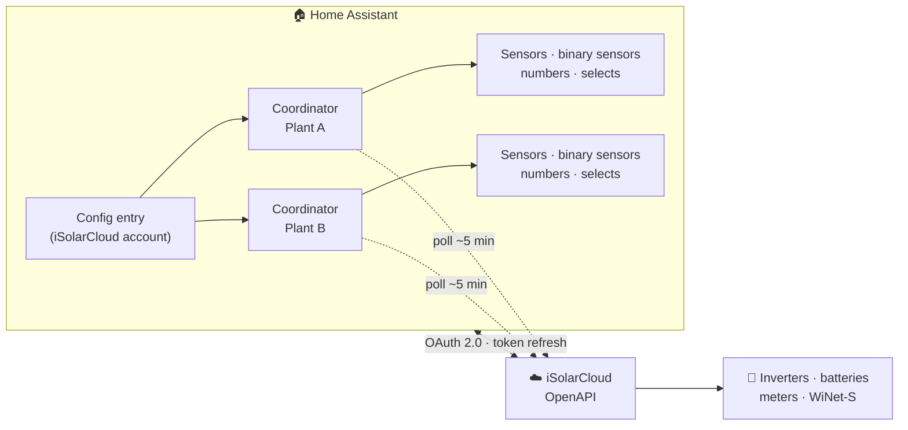

# Sungrow iSolarCloud for Home Assistant

A [Home Assistant](https://www.home-assistant.io/) custom integration that polls **Sungrow
inverters** through the **iSolarCloud** cloud API, using the
[`sungrow-isolarcloud`](https://github.com/KRoperUK/pysolarcloud) library. Distributed via
[HACS](https://hacs.xyz/).

[Install & set up :material-arrow-right:](installation.md){ .md-button .md-button--primary }
[Configuration](configuration.md){ .md-button }

## Features

- **Cloud polling** — real-time data from the iSolarCloud API (`iot_class: cloud_polling`).
- **Auto-discovery** — finds every plant linked to your account.
- **Rich sensors** — power, energy, battery SOC, and more, with correct device/state classes so
  they work in the Energy dashboard out of the box.
- **Device health & diagnostics** — per-device **Fault** and **Connectivity** binary sensors,
  device-level diagnostics (inverter temperature, MPPT, WLAN signal), and device cards enriched
  with model, serial number and manufacturer.
- **Per-device grouping** — plant readings are grouped under the physical device they come from
  (inverter, battery, meter, WiNet-S), nested beneath the plant, so the device tree mirrors your
  hardware. Entity IDs and history are unchanged; multi-inverter aggregates stay on the plant.
- **Plant health & tariffs** — plant-wide alarm/fault counts, nameplate power, and your configured
  import/export electricity prices, surfaced as sensors on the plant device.
- **Custom measure points** — request additional iSolarCloud point IDs (e.g. battery
  charge/discharge power or EV-charger values) from the options flow.
- **Dispatch / control** — number and select entities for charge/discharge command, power, SOC
  limits, forced charging and export/active-power limiting, with an automatic EMS heartbeat while
  dispatching. Battery controls are hidden on PV-only plants.
- **Safer dispatch** — an optional **Forced Dispatch Duration** auto-reverts a forced
  charge/discharge to *Stop* after a set time (surviving restarts), so it can't silently persist.
- **Resilient polling** — rides out brief API/network hiccups instead of flapping unavailable, and
  auto-backs-off when rate-limited.
- **Guided repairs** — whitelist and rate-limit rejections surface as actionable Home Assistant
  Repairs.
- **UI config flow** — set up entirely through the Home Assistant interface.
- **Token persistence & re-auth** — refreshed tokens are saved automatically, so entities stay
  available across restarts; if credentials expire you're prompted to re-authorize in place.
- **Configurable polling interval** — tune how often data is fetched.

## How it works

The integration authorizes **once** against your iSolarCloud OpenAPI application, then discovers
every plant on the account and runs one *coordinator* per plant that polls the cloud on your
chosen interval. Each rotated refresh token is written back to the config entry, so entities stay
available across restarts.

Your hardware maps cleanly onto Home Assistant's device tree — see
[Device grouping](SENSORS.md#device-grouping) for how the account → plant → device hierarchy is
modelled.

## Requirements

- Home Assistant with [HACS](https://hacs.xyz/) installed.
- A Sungrow **iSolarCloud** account with your plant(s) registered.
- An **iSolarCloud OpenAPI application** (App ID, App Key, App Secret) — see
  [Installation & Setup](installation.md).

!!! tip "New here?"
    Start with [Installation & Setup](installation.md). If something goes wrong, the
    [Troubleshooting](TROUBLESHOOTING.md) page covers the common auth and "unavailable" issues.

## Links

- Source & issues: [github.com/KRoperUK/sungrow-hass](https://github.com/KRoperUK/sungrow-hass)
- Library: [`sungrow-isolarcloud` / pysolarcloud](https://github.com/KRoperUK/pysolarcloud)
