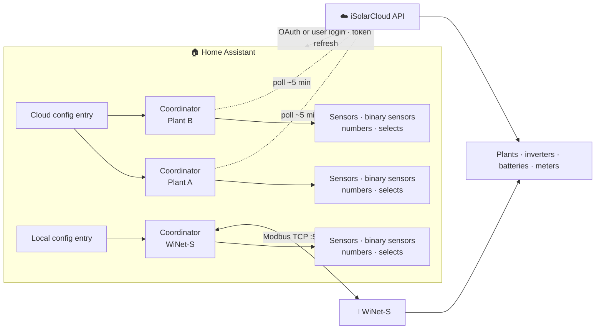

# Sungrow iSolarCloud for Home Assistant

A [Home Assistant](https://www.home-assistant.io/) custom integration that polls **Sungrow
inverters** through the **iSolarCloud** cloud API, using the
[`sungrow-isolarcloud`](https://github.com/KRoperUK/pysolarcloud) library. Distributed via
[HACS](https://hacs.xyz/).

[Install & set up :material-arrow-right:](installation.md){ .md-button .md-button--primary }
[Configuration](configuration.md){ .md-button }

## Features

- **Three transport modes** — official OAuth OpenAPI, unofficial user-account login (no
  developer app required — see [caveats](local-modbus.md#cloud-user-account-unofficial)), or
  **local Modbus (WiNet-S)** as a separate independent entry (see [Local Modbus](local-modbus.md)).
  Cloud and local entries never merge state; when serials match, the local device is soft-linked
  under the cloud plant.
- **Auto-discovery** — cloud discovers every plant on the account; local offers a **Discovered**
  card when a WiNet-S dongle appears on your LAN. Cloud accounts with more than one plant open a
  **plant picker** during setup so you choose which to integrate.
- **Guided Modbus wizard** — manual local setup scans the LAN for dongles, reads the inverter
  model + serial straight from Modbus registers, and confirms comms before creating the entry.
- **Rich sensors** — power, energy, battery SOC, per-string DC, per-phase AC and more, classified
  with the correct `device_class` / `state_class` so they land in the Energy dashboard
  automatically. See the [Model support matrix](model-support.md) for what each family reports.
- **Device health & diagnostics** — per-device **Fault** and **Connectivity** binary sensors,
  device-level diagnostics (inverter temperature, MPPT, WLAN signal), and device cards enriched
  with model, serial number and manufacturer.
- **Per-device grouping** — plant readings are grouped under the physical device they come from
  (inverter, battery, meter, WiNet-S), nested beneath the plant, so the device tree mirrors your
  hardware. Entity IDs and history are unchanged; multi-inverter aggregates stay on the plant.
- **Plant health & tariffs** — plant-wide alarm/fault counts, nameplate power, and your configured
  import/export electricity prices, surfaced as sensors on the plant device.
- **Custom measure points** — request additional iSolarCloud point IDs (e.g. battery
  charge/discharge power or EV-charger values) from the options flow.
- **Battery dispatch** — a single **Battery Mode** select (Self-consumption / Force charge /
  Force discharge / Stop) plus power/SOC numbers, forced charging and battery-first mode, with an
  automatic EMS heartbeat while force-dispatching. Battery controls are hidden on PV-only plants.
  Automations can call **`sungrow.set_battery_mode`**.
- **Scheduled forced-charge / forced-discharge windows** — two daily windows (start/end HH:MM
  local, wrap-over-midnight supported) that automatically enter Force charge or Force discharge
  and revert afterwards.
- **Safer dispatch** — **Forced Dispatch Duration** (default **60 minutes**) auto-reverts a
  forced mode after the set time (surviving restarts), so a command can't silently persist. Set
  the duration to `0` only if you intentionally want unbounded forced commands.
- **Grid / export limiting** — export limit (power and %), active-power limiting, and reactive-
  power regulation (Off / Power Factor / Q(t) / Q(P) / Q(U)). Available on PV-only plants too.
- **Resilient polling** — rides out brief API/network hiccups instead of flapping unavailable, and
  auto-backs-off when rate-limited.
- **Guided repairs** — whitelist and rate-limit rejections, an unexpectedly-stopped
  dispatch keepalive, and dispatch commands the inverter didn't actually apply, surface
  as actionable Home Assistant Repairs.
- **Historical backfill** — `sungrow.backfill` service imports iSolarCloud historical data into
  Home Assistant long-term statistics so the History and Energy dashboards are populated
  immediately after setup.
- **Token persistence & re-auth** — refreshed tokens are saved automatically, so entities stay
  available across restarts; if credentials expire you're prompted to re-authorize in place. A
  `sungrow.refresh_tokens` service is available for support triage.
- **Configurable polling interval** — tune how often data is fetched.

## How it works

For a **cloud entry**, the integration authorizes **once** against your iSolarCloud OpenAPI
application (or logs in with your user credentials), discovers every plant on the account, and
runs one *coordinator* per plant that polls the cloud on your chosen interval. Each rotated refresh
token is written back to the config entry, so entities stay available across restarts.

For a **local Modbus entry**, one coordinator per WiNet-S dongle polls its inverter directly on
TCP 502 with no cloud involvement.

Your hardware maps cleanly onto Home Assistant's device tree — see
[Device grouping](SENSORS.md#device-grouping) for how the account → plant → device hierarchy is
modelled.

## Requirements

- Home Assistant with [HACS](https://hacs.xyz/) installed.
- A Sungrow **iSolarCloud** account with your plant(s) registered.
- **One of**: an iSolarCloud **OpenAPI application** (Developer transport), your **iSolarCloud
  email + password** (User Account transport), or a **WiNet-S dongle** reachable on your LAN
  (Modbus transport). See [Installation & Setup](installation.md) for each path.

!!! tip "New here?"
    Start with [Installation & Setup](installation.md). Want fast local reads or a cloud-free
    setup? See [Local Modbus (WiNet-S)](local-modbus.md). If something goes wrong, the
    [Troubleshooting](TROUBLESHOOTING.md) page covers the common auth and "unavailable" issues.

## Links

- Source & issues: [github.com/KRoperUK/sungrow-hass](https://github.com/KRoperUK/sungrow-hass)
- Library: [`sungrow-isolarcloud` / pysolarcloud](https://github.com/KRoperUK/pysolarcloud)
