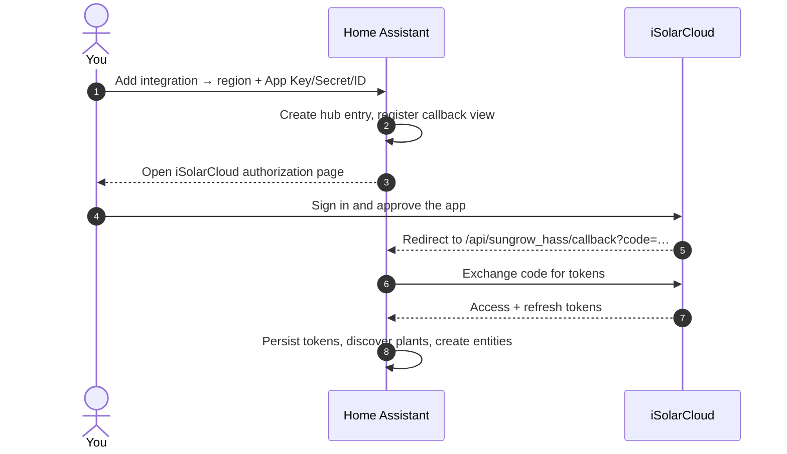

# Installation & Setup

You have **three ways to connect**, and you pick which one when you add the integration in
Home Assistant:

| Transport | You need | Best for |
| --- | --- | --- |
| **Cloud (Developer Account via Official OpenAPI - Cloud Polling)** | An iSolarCloud OpenAPI application (App Key + Secret + ID) approved by Sungrow. | Full plant sensors + battery dispatch on the official, documented API. |
| **Cloud (User Account via Unofficial API - Cloud Polling)** | The email + password you use in the iSolarCloud app/web portal. | Getting started without registering a developer app. See caveats on the [Local Modbus](local-modbus.md#cloud-user-account-unofficial) page. |
| **Modbus (Local Polling)** | A WiNet-S dongle (or the inverter's internal LAN port) on the same LAN. | Fast local reads with no API quota; works while iSolarCloud is unreachable. |

You can run **multiple transports side-by-side** (e.g. a Cloud entry plus a local Modbus
entry for the same inverter) — each becomes its own config entry and their entities stay
separate.

The rest of this page walks the three paths. All start the same way:

**Settings → Devices & Services → Add Integration → Sungrow iSolarCloud**, then pick your
transport from the drop-down.

---

## 1. Install via HACS

1. In Home Assistant, open **HACS**.
2. Search for **Sungrow iSolarCloud** and download it. (If it isn't listed yet, add
   `https://github.com/KRoperUK/sungrow-hass` as a custom repository of type *Integration*.)
3. **Restart Home Assistant.**

### Pre-release / PR builds (optional)

CI publishes **prerelease** GitHub Releases when component-impacting PRs or `main` pushes go green:

| Kind | Tag shape | Install |
| --- | --- | --- |
| Main RC | `vX.Y.Z-rc.N` | HACS pre-releases, or download `sungrow.zip` from the release |
| PR build | `vX.Y.Z-pr.<PR>.<run>` | Same; tag points at a **synthetic commit** that only rewrites `manifest.json` / `const.VERSION` so HACS sorts above the last stable |

Enable **Show beta versions** (pre-releases) for this repository in HACS if you intend to dogfood. Prefer a **specific pre-release tag** over a floating branch tip. PR pre-releases are deleted when the PR closes; do not rely on them long-term.

---

## 2A. Cloud (Developer Account) — recommended if you want dispatch on the official API

### Create an iSolarCloud OpenAPI application

The integration talks to iSolarCloud's OpenAPI, which requires your own application credentials.

1. Go to the **iSolarCloud Developer Portal**
   ([developer-api.isolarcloud.com](https://developer-api.isolarcloud.com/)) and sign in with
   your iSolarCloud account.
2. Under **Applications**, create a new application and **enable OAuth 2.0** — the Home Assistant
   flow uses the OAuth 2.0 authorization-code grant (browser redirect + code exchange), so
   authorization fails if OAuth 2.0 is not enabled for the app.
3. Note the three credentials it issues: **App Key**, **App Secret**, and **App ID**.
4. Set the application's **redirect / callback URL** to your Home Assistant callback:

    ```text
    https://<your-home-assistant>/api/sungrow_hass/callback
    ```

    Use the same external URL you reach Home Assistant on (the one in
    **Settings → System → Network → Home Assistant URL**). If you type only the base URL
    (e.g. `http://192.168.1.20:8123`), Home Assistant auto-appends the callback path — but
    the value stored in the developer portal must **still be the full URL with the path**.
5. **Authorize your plant** to the application (Power Station Sharing in iSolarCloud), so the app
   can read its data.

!!! note "Application review"
    A newly created application can take a few working days to be approved before its credentials
    work. Also make sure your app is registered on the **same region** as your account.

!!! warning "Keep your App ID private"
    Anyone who knows your App ID can authorize *their* plant to your application. Don't publish it
    in screenshots, issues, or documentation.

### Add and authorize the integration

Setup is two-phase: Home Assistant creates the hub entry first (so the OAuth callback endpoint
exists *before* any redirect — this avoids a first-install 404), then walks you through
authorization. At a glance:



1. **Add Integration → Sungrow iSolarCloud → Cloud (Developer Account …)** in the transport
   picker.
2. Select your **Gateway region** (Europe, International, China, or Australia — it must match the
   region your devices are physically connected to).
3. Enter your **App Key**, **App Secret**, and **App ID** exactly as issued — with **no
   surrounding quotes or spaces**.
4. You'll be sent to iSolarCloud to **authorize** the application in your browser. Approve it; you
   are redirected back and Home Assistant stores the tokens.

    !!! tip "Manual authorization fallback"
        If the automatic redirect doesn't complete, the flow shows a link and a box — open the
        link, approve, then paste the `code` (or the full redirect URL) back into Home Assistant.
        Authorization codes are single-use, so use a fresh one if it says "invalid".

5. **Multi-plant accounts** get a plant picker after authorization — every plant is selected by
   default, uncheck any you don't want. You can revisit the selection later via **Reconfigure**.

Once authorized, the integration discovers your plant(s) and creates the sensors. See
[Configuration](configuration.md) to tune polling, enable extra points, or set up scheduled
forced-charge windows. See [Troubleshooting](TROUBLESHOOTING.md) if entities don't appear.

!!! info "Changing region or credentials later"
    Use **Reconfigure** on the integration entry to update the region or API credentials. The
    **App ID is fixed** for an entry — if you retire an app and create a *new* App ID, remove the
    integration and add it again rather than reconfiguring.

---

## 2B. Cloud (User Account) — quickest to get started, no developer app

Use the email + password you use in the iSolarCloud mobile app. No portal registration or
Sungrow approval step. Uses Sungrow's undocumented app/web API, so it's marked
**experimental** — see the [caveats section](local-modbus.md#cloud-user-account-unofficial)
before choosing this transport.

1. **Add Integration → Sungrow iSolarCloud → Cloud (User Account …)** in the transport picker.
2. Enter your **email**, **password**, and **region**. The region must match the app you log
   into — most login failures ("account or password incorrect") are actually wrong-region
   errors. Repeated failed attempts can temporarily lock the account, so double-check the
   region before retrying.
3. On success, plants are discovered and sensors + dispatch entities are created.

Passwords are stored in the (HA-encrypted) config entry and never logged. Prefer the
developer transport (2A) if you need the official OpenAPI or the fullest device-level metrics.

---

## 2C. Modbus (Local Polling) — no cloud account required

The **WiNet-S dongle** (or the inverter's internal LAN port where enabled) speaks Modbus TCP
on port 502. Home Assistant reads directly from it — no API quota, works offline. Cloud and
local entries stay independent; when serials match, the local device is soft-linked under the
cloud plant.

**Auto-discovery** (easiest): as soon as HA sees the dongle on mDNS, a **Discovered** card
appears on **Settings → Devices & Services**. Click **Set up** and confirm — that's it.

**Guided manual setup** (when auto-discovery didn't fire): **Add Integration → Sungrow
iSolarCloud → Modbus (Local Polling)** opens a four-step wizard:

1. **Discovery** — HA runs a short mDNS scan. Any WiNet-S dongles that answer are listed by
   model + serial + IP; pick one, choose **Enter IP manually**, or **Rescan**.
2. **Manual IP** *(if used)* — type the WiNet-S IP or hostname. HA probes TCP port 502.
3. **Identify** — HA reads the inverter model (register 4999) and serial (register 4989)
   directly from Modbus and shows them for you to confirm.
4. **Confirm** — a final Modbus read is used as the create-entry probe. On success the entry
   is created; on failure the wizard surfaces the reason so you can retry or back up.

If model or serial can't be auto-read (older firmware, non-standard model code), the wizard
falls through to a manual details form pre-filled with what it did read.

See [Local Modbus (WiNet-S)](local-modbus.md) for supported inverter families and control
capabilities.
