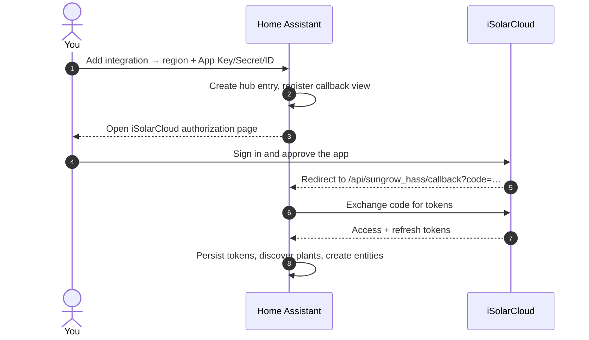

# Installation & Setup

Setting up the integration has three parts: create an **iSolarCloud OpenAPI application**,
install the integration via **HACS**, then **add and authorize** it in Home Assistant.

## 1. Create an iSolarCloud OpenAPI application

The integration talks to iSolarCloud's OpenAPI, which requires your own application credentials.

1. Go to the **iSolarCloud Developer Portal**
   ([developer-api.isolarcloud.com](https://developer-api.isolarcloud.com/)) and sign in with
   your iSolarCloud account.
2. Under **Applications**, create a new application and **enable OAuth 2.0** — the Home Assistant
   flow uses the OAuth 2.0 authorization-code grant (browser redirect + code exchange), so
   authorization fails if OAuth 2.0 is not enabled for the app.
3. Note the three credentials it issues: **App Key**, **App Secret**, and **App ID**.
4. Set the application's **redirect / callback URL** to your Home Assistant callback:

    ```text
    https://<your-home-assistant>/api/sungrow_hass/callback
    ```

    Use the same external URL you reach Home Assistant on (the one in
    **Settings → System → Network → Home Assistant URL**).
5. **Authorize your plant** to the application (Power Station Sharing in iSolarCloud), so the app
   can read its data.

!!! note "Application review"
    A newly created application can take a few working days to be approved before its credentials
    work. Also make sure your app is registered on the **same region** as your account.

!!! warning "Keep your App ID private"
    Anyone who knows your App ID can authorize *their* plant to your application. Don't publish it
    in screenshots, issues, or documentation.

## 2. Install via HACS

1. In Home Assistant, open **HACS**.
2. Search for **Sungrow iSolarCloud** and download it. (If it isn't listed yet, add
   `https://github.com/KRoperUK/sungrow-hass` as a custom repository of type *Integration*.)
3. **Restart Home Assistant**.

## 3. Add and authorize the integration

Setup is two-phase: Home Assistant creates the hub entry first (so the OAuth callback endpoint
exists *before* any redirect — this avoids a first-install 404), then walks you through
authorization. At a glance:



1. Go to **Settings → Devices & Services → Add Integration** and choose **Sungrow iSolarCloud**.
2. Select your **Gateway region** (Europe, International, China, or Australia — it must match the
   region your devices are physically connected to).
3. Enter your **App Key**, **App Secret**, and **App ID** exactly as issued — with **no
   surrounding quotes or spaces**.
4. You'll be sent to iSolarCloud to **authorize** the application in your browser. Approve it; you
   are redirected back and Home Assistant stores the tokens.

    !!! tip "Manual authorization fallback"
        If the automatic redirect doesn't complete, the flow shows a link and a box — open the
        link, approve, then paste the `code` (or the full redirect URL) back into Home Assistant.
        Authorization codes are single-use, so use a fresh one if it says "invalid".

Once authorized, the integration discovers your plant(s) and creates the sensors. See
[Configuration](configuration.md) to tune polling and enable extra points, or
[Troubleshooting](TROUBLESHOOTING.md) if entities don't appear.

!!! info "Changing region or credentials later"
    Use **Reconfigure** on the integration entry to update the region or API credentials. The
    **App ID is fixed** for an entry — if you retire an app and create a *new* App ID, remove the
    integration and add it again rather than reconfiguring.
