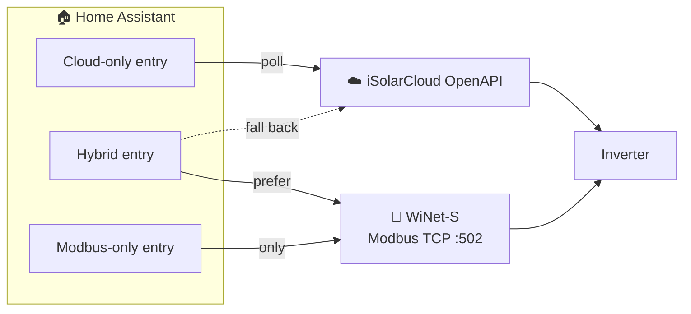
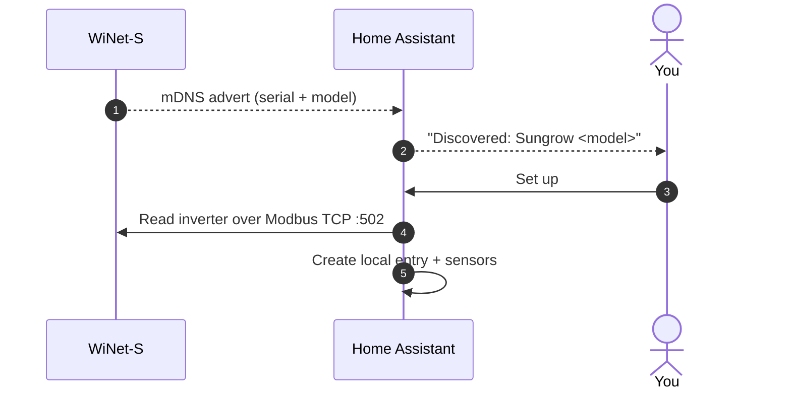

# Local Modbus (WiNet-S)

Besides the cloud, the integration can read your inverter **directly over your local
network** using the **WiNet-S** dongle's Modbus TCP interface. Local reads are fast,
don't count against any API quota, and keep working even when the internet (or
iSolarCloud) is down.

You can use local Modbus in two ways: **on its own** (a fully cloud-free setup, created by
auto-discovery) or **alongside the cloud** (a hybrid entry that reads locally first and
falls back to the cloud). The [transport modes](#transport-modes) section explains when to
pick each.

!!! info "What's supported today"
    Local Modbus currently maps the **SG-RS single-phase string inverters** (e.g. SG3.6RS)
    and is **read-only**. Wider model coverage and local control are tracked in
    [#219](https://github.com/KRoperUK/sungrow-hass/issues/219) and
    [#220](https://github.com/KRoperUK/sungrow-hass/issues/220) — see
    [Current limitations](#current-limitations).

## What you need

- A **WiNet-S** communication dongle on the **same LAN** as Home Assistant.
- The dongle reachable on **TCP port 502** (Modbus TCP) from Home Assistant — the default
  Modbus port and unit ID (`1`) are used automatically.
- **No iSolarCloud account** for a Modbus-only setup. (The hybrid mode still needs the cloud
  account for its cloud half.)
- A supported inverter — **SG-RS** today (see [limitations](#current-limitations)).

!!! tip "mDNS discovery must be able to reach Home Assistant"
    The dongle is found via **mDNS/zeroconf**, which doesn't cross subnets or VLANs by
    default. If Home Assistant and the WiNet-S are on different network segments, discovery
    won't fire — add Modbus manually instead (see
    [Add local Modbus to a cloud entry](#hybrid-add-local-modbus-to-a-cloud-entry)).

## Transport modes

The integration supports three "transport" modes. They differ in where readings come from
and whether a cloud account is involved:

| Mode | Data source | Cloud account | Control (dispatch) | Best for |
| --- | --- | --- | --- | --- |
| **Cloud-only** *(default)* | iSolarCloud API | Required | ✅ Yes | The standard setup — full sensor set and battery/dispatch controls. |
| **Cloud + Modbus** *(hybrid)* | Local Modbus **first**, cloud fallback | Required | ✅ Yes (via cloud) | Fast, unmetered local reads **plus** the cloud's full sensor and control set. |
| **Modbus-only** *(local)* | Local Modbus only | **Not needed** | ❌ Read-only | Offline / privacy-first setups, or where you don't have working cloud credentials. |

**Which should I choose?**

- **Just getting started, or you want battery/dispatch control** → **Cloud-only**. Start
  from [Installation & Setup](installation.md).
- **You already run cloud and want faster, quota-free local reads** → **Hybrid**. Keep your
  cloud entry and [add a Modbus host](#hybrid-add-local-modbus-to-a-cloud-entry) to it.
- **No cloud account (or it isn't working) and you only need read-only sensors** →
  **Modbus-only**, via [auto-discovery](#modbus-only-set-up-from-auto-discovery).

## Modbus-only: set up from auto-discovery

When a WiNet-S dongle appears on your network, Home Assistant discovers it automatically and
offers a **cloud-free** local setup.

1. Go to **Settings → Devices & Services**. A **Discovered** card reading **Sungrow
   *&lt;model&gt;*** appears (identified from the dongle's advertised serial and model).
2. Click **Set up**. A confirmation screen explains it will read the inverter directly over
   local Modbus — no iSolarCloud account required.
3. Confirm. Home Assistant creates an entry titled **"Sungrow *&lt;model&gt;* (local)"** and
   its sensors. Polling defaults to **30 seconds** (there's no cloud quota, so you can poll
   frequently — the minimum is 10 seconds).

!!! note "Already set up via the cloud?"
    If this same inverter is **already configured through iSolarCloud**, discovery detects
    that (by matching the serial number) and instead offers to **add local Modbus to your
    existing entry** — see below. This avoids creating a duplicate device.

### If the inverter is already on the cloud (attach prompt)

When discovery finds a dongle for an inverter you already monitor via iSolarCloud, it shows
an **"Add local Modbus to your Sungrow inverter"** prompt naming the discovered model, its
host, and the matching cloud entry. Confirming enables **hybrid** mode on that existing cloud
entry — local reads with cloud fallback, **one device, no duplicate**. To keep things
cloud-only instead, simply ignore the discovery card.

## Hybrid: add local Modbus to a cloud entry

You can also enable Modbus on an existing cloud entry manually, at any time:

**Settings → Devices & Services → Sungrow iSolarCloud → Configure → Local Modbus host.**

Enter the WiNet-S IP address and save. The entry reloads and starts serving **Modbus-preferred**
values: each reading comes from the local dongle when available and **falls back to the cloud**
otherwise, so you keep the full cloud sensor set and all dispatch/control entities while the
common metrics update quickly and without using API quota. **Leave the field blank** to stay
cloud-only.

!!! tip "Assign the dongle a static IP"
    A hybrid or Modbus-only entry addresses the dongle by IP. Give the WiNet-S a **DHCP
    reservation / static lease** on your router so the address doesn't change. If it does
    change, discovery updates a Modbus-only entry automatically; for a hybrid entry, update
    the **Local Modbus host** field, or use **Reconfigure** on a Modbus-only entry.

## Options and reconfigure

**Modbus-only entry — options** (**Configure**): only the **polling interval** (default 30 s,
minimum 10 s). There are no cloud-specific options because no cloud account is involved.

**Modbus-only entry — reconfigure**: updates the **WiNet-S IP address** if it changed on your
network. It does **not** ask for any iSolarCloud credentials.

**Hybrid (cloud) entry — options**: the usual cloud options (polling interval, custom measure
points, per-device sensors) **plus** the **Local Modbus host** field. Clear the host to drop
back to cloud-only.

## What you get over Modbus

The SG-RS register map exposes the inverter's core generation metrics directly, including:

- **Total** and **daily** energy yield
- **AC** (total active) and **DC** power
- **MPPT** string voltages and currents
- **Grid frequency** and AC voltage
- **Internal temperature**

In **hybrid** mode these overlay the cloud data (Modbus wins where it has a value); in
**Modbus-only** mode they're the full sensor set for the entry.

## Current limitations

- **SG-RS inverters only.** The bundled register map covers the SG-RS single-phase string
  inverters. SH hybrids, three-phase SG, and standalone battery/meter maps are tracked in
  [#219](https://github.com/KRoperUK/sungrow-hass/issues/219). On other models, use
  **cloud-only** or **hybrid** (the cloud half still returns everything).
- **Read-only.** Local Modbus reads sensors; it does not yet write. Battery/dispatch control
  still goes through the cloud, so use **hybrid** if you want both fast local reads and
  control. Local write support is tracked in
  [#220](https://github.com/KRoperUK/sungrow-hass/issues/220).
- **`daily_yield` can read high** versus the cloud on some SG-RS firmware — a scaling/semantics
  mismatch under investigation in
  [#223](https://github.com/KRoperUK/sungrow-hass/issues/223). `total_yield` matches the cloud.
- **One local connection.** The WiNet-S serves a limited number of Modbus TCP clients; if you
  already poll it from another tool, reads here may fail intermittently.

See [Troubleshooting → Local Modbus](TROUBLESHOOTING.md#local-modbus-winet-s) if discovery
doesn't appear or local reads fail.
