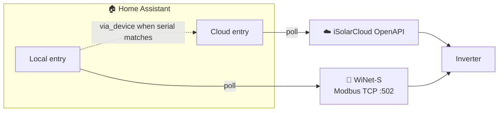

# Local Modbus (WiNet-S)

Besides the cloud, the integration can read your inverter **directly over your local
network** using the **WiNet-S** dongle's Modbus TCP interface. Local reads are fast,
don't count against any API quota, and keep working even when the internet (or
iSolarCloud) is down.

**Cloud and local are separate config entries.** They never mash values onto the same
sensors. If both exist for the same inverter serial, the local device is nested under
the cloud plant in the device registry (`via_device`) — a soft “related to” link only.

!!! info "What's supported today"
    Local Modbus currently maps the **SG-RS single-phase string inverters** (e.g. SG3.6RS)
    and is **read-only**. Wider model coverage and local control are tracked in
    [#219](https://github.com/KRoperUK/sungrow-hass/issues/219) and
    [#220](https://github.com/KRoperUK/sungrow-hass/issues/220) — see
    [Current limitations](#current-limitations).

## What you need

- A **WiNet-S** communication dongle on the **same LAN** as Home Assistant.
- The dongle reachable on **TCP port 502** (Modbus TCP) from Home Assistant — the default
  Modbus port and unit ID (`1`) are used automatically.
- **No iSolarCloud account** for a Modbus-only setup. (A cloud entry is independent and
  still needs credentials for its own sensors and dispatch.)
- A supported inverter — **SG-RS** today (see [limitations](#current-limitations)).

!!! tip "mDNS discovery must be able to reach Home Assistant"
    The dongle is found via **mDNS/zeroconf**, which doesn't cross subnets or VLANs by
    default. If Home Assistant and the WiNet-S are on different network segments, discovery
    won't fire — add the local entry manually when that path is available, or ensure mDNS
    can cross the boundary.

## Transport modes

| Mode | Data source | Cloud account | Control (dispatch) | Best for |
| --- | --- | --- | --- | --- |
| **Cloud-only** | iSolarCloud OpenAPI | Developer app (App Key/Secret/ID) | ✅ Yes | Full plant sensors and battery/dispatch controls. |
| **Cloud (user account)** *(unofficial)* | iSolarCloud app/web API | Just email + password | ❌ Not yet | No developer app — quickest cloud setup. See caveats below. |
| **Modbus-only** *(local)* | Local Modbus only | **Not needed** | ❌ Read-only | Fast local metrics, offline / privacy-first. |
| **Both** *(two entries)* | Each entry its own source | Cloud entry only | Via **cloud** entry | Compare or use cloud + local side by side. |

### Cloud user account (unofficial)

If you don't have (or don't want to register) an iSolarCloud **developer application**, you can connect with the **normal email + password** you use in the iSolarCloud app/web portal. Choose **Cloud (user account, unofficial)** as the transport and enter your email, password and region.

!!! warning "Unofficial and experimental"
    This uses Sungrow's **undocumented app/web API**, not the official OpenAPI. It may change or stop working without notice, and its use may be subject to Sungrow's terms of service. Your password is stored in the Home Assistant config entry and is never logged. Prefer the developer **Cloud-only** transport if you can.

Current limitations:

- **Plant-level data only** so far (e.g. current power, daily/total yield, alarm/fault counts) — from the `getPsDetail` endpoint. Per-device and richer measure points may follow.
- **No dispatch/control** — read-only. Use the developer Cloud-only transport for charge/discharge and other controls.
- If login fails with "account or password incorrect", it's most often the **wrong region** — pick the region your account actually uses.

**Which should I choose?**

- **Battery/dispatch control or full plant metrics** → **Cloud** entry from
  [Installation & Setup](installation.md).
- **Fast local power / yield without API quota** → **Local** via
  [auto-discovery](#modbus-only-set-up-from-auto-discovery).
- **Both** → set up each entry independently. Pick which entities to use in Energy /
  automations deliberately (e.g. cloud daily vs local derived daily).

## Modbus-only: set up from auto-discovery

When a WiNet-S dongle appears on your network, Home Assistant discovers it and offers a
**standalone local** setup.

1. Go to **Settings → Devices & Services**. A **Discovered** card reading **Sungrow
   *&lt;model&gt;*** appears (from the dongle's advertised serial and model).
2. Click **Set up** and confirm. Home Assistant creates **"Sungrow *&lt;model&gt;* (local)"**.
3. Polling defaults to **30 seconds** (no cloud quota; minimum 10 seconds).

If the same inverter is already on a **cloud** entry (matched by serial), the local
inverter device is placed **under that cloud plant** in the UI. Entities stay separate —
nothing is merged.

### Reconfigure / IP change

- **Options** on the local entry: poll interval and optional daily-yield register debug.
- **Reconfigure** (or rediscovery): update the WiNet-S host if DHCP moved the dongle.

## Upgrading from hybrid (old “Modbus host on cloud”)

Earlier builds allowed putting a WiNet-S IP on the **cloud** entry and merging Modbus
values over cloud sensors. That mashup is removed:

1. On load, any leftover `modbus_host` is **stripped** from the cloud entry.
2. When the inverter serial is already in the device registry, a **separate local entry**
   is created automatically with that host.
3. If no serial is known yet, set up local Modbus via discovery once more.

## Daily yield (local)

On some SG-RS + WiNet-S firmwares the “daily” register never resets at midnight. The local
entry **derives** calendar-day yield from lifetime `total_yield` (baseline stored in HA).
Cloud daily yield remains whatever iSolarCloud reports — they can differ; that is expected
with two independent sources.

## Current limitations

- **SG-RS register map** only (see issues above for other models).
- **Read-only** — charge/dispatch stays on the cloud API when you have a cloud entry.
- Local and cloud **do not share** entities; configure Energy/dashboards explicitly.
