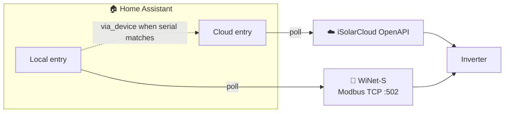

# Local Modbus (WiNet-S)

Besides the cloud, the integration can read your inverter **directly over your local
network** using the **WiNet-S** dongle's Modbus TCP interface. Local reads are fast,
don't count against any API quota, and keep working even when the internet (or
iSolarCloud) is down.

**Cloud and local are separate config entries.** They never mash values onto the same
sensors. If both exist for the same inverter serial, the local device is nested under
the cloud plant in the device registry (`via_device`) — a soft “related to” link only.

!!! info "What's supported today"
    Local Modbus is **read-only** and maps:

    - **SG-RS / SG-RT** string inverters (single- and three-phase low-block layout)
    - **SH-RS / SH-RT** hybrid inverters (battery SOC/power, house load, meter points)

    Family is auto-detected from register 5000 (device-type code) or the configured
    model string. Local **control** (writes) is tracked in
    [#220](https://github.com/KRoperUK/sungrow-hass/issues/220); remaining map gaps in
    [#219](https://github.com/KRoperUK/sungrow-hass/issues/219).

## What you need

- A **WiNet-S** communication dongle **or** the inverter's internal LAN port on the
  **same LAN** as Home Assistant. The internal LAN port, where present, is generally
  the more reliable path — it may need to be **enabled from the iSolarCloud app**
  first (see [Troubleshooting → The Ethernet port on the inverter appears dead](TROUBLESHOOTING.md#the-ethernet-port-on-the-inverter-appears-dead)).
- The device reachable on **TCP port 502** (Modbus TCP) from Home Assistant — the default
  Modbus port and unit ID (`1`) are used automatically.
- **No iSolarCloud account** for a Modbus-only setup. (A cloud entry is independent and
  still needs credentials for its own sensors and dispatch.)
- A supported inverter family — **SG string** or **SH hybrid** (see [Model support](model-support.md#cloud-vs-local-modbus)).

!!! tip "mDNS discovery must be able to reach Home Assistant"
    The dongle is found via **mDNS/zeroconf**, which doesn't cross subnets or VLANs by
    default. If Home Assistant and the WiNet-S are on different network segments, discovery
    won't fire — add the local entry manually when that path is available, or ensure mDNS
    can cross the boundary.

!!! info "Flaky WiNet-S connection?"
    The WiNet-S dongle sometimes drops idle Modbus TCP sessions. If reads flap in and
    out, a stateful proxy like [`Akulatraxas/ha-modbusproxy`](https://github.com/Akulatraxas/ha-modbusproxy)
    in front of the dongle is the community-standard workaround — see
    [Troubleshooting → WiNet-S drops connections](TROUBLESHOOTING.md#winet-s-drops-connections-or-reads-flap-in-and-out).

## Transport modes

| Mode | Data source | Cloud account | Control (dispatch) | Best for |
| --- | --- | --- | --- | --- |
| **Cloud (Developer Account via Official OpenAPI - Cloud Polling)** | iSolarCloud OpenAPI | Developer app (App Key/Secret/ID) | ✅ Yes | Full plant sensors and battery/dispatch controls. |
| **Cloud (User Account via Unofficial API - Cloud Polling)** | iSolarCloud app/web API | Just email + password | ✅ Yes (experimental) | No developer app — sensors + dispatch. See caveats below. |
| **Modbus (Local Polling)** | Local Modbus only | **Not needed** | ✅ Active power limit (SG string) | Fast local metrics + limited local control; offline / privacy-first. |
| **Both** *(two entries)* | Each entry its own source | Cloud entry only | Full dispatch via **cloud**; local active-power on local entry | Compare or use cloud + local side by side. |

### Cloud user account (unofficial)

If you don't have (or don't want to register) an iSolarCloud **developer application**, you can connect with the **normal email + password** you use in the iSolarCloud app/web portal. Choose **Cloud (User Account via Unofficial API - Cloud Polling)** as the transport and enter your email, password and region.

!!! warning "Unofficial and experimental"
    This uses Sungrow's **undocumented app/web API**, not the official OpenAPI. It may change or stop working without notice, and its use may be subject to Sungrow's terms of service. Your password is stored in the Home Assistant config entry and is never logged. Prefer the developer **Cloud-only** transport if you can.

Current limitations:

- **Plant-level realtime** from `getPsDetail` (power, yield, alarm/fault counts, …). Device discovery is used for dispatch targeting; per-device sensor parity with OAuth may still differ by model.
- **Dispatch** uses the same number/select entities and safety rails as the developer Cloud transport (battery gating, forced-mode verification, EMS heartbeat). Some EMS modes (e.g. Energy Management Mode on PV-only plants) may report “template not configured” — that is a plant capability limit, not a missing feature.
- Prefer the developer **Cloud-only** transport when you need the official OpenAPI path or full OAuth device metrics.
- If login fails with "account or password incorrect", it's most often the **wrong region** — pick the region your account actually uses.

**Which should I choose?**

- **Battery/dispatch control or full plant metrics** → **Cloud** entry from
  [Installation & Setup](installation.md).
- **Fast local power / yield without API quota** → **Local** via
  [auto-discovery](#modbus-only-set-up-from-auto-discovery).
- **Both** → set up each entry independently. Pick which entities to use in Energy /
  automations deliberately (e.g. cloud daily vs local derived daily).

## Modbus-only: set up from auto-discovery

When a WiNet-S dongle appears on your network, Home Assistant discovers it and offers a
**standalone local** setup.

1. Go to **Settings → Devices & Services**. A **Discovered** card reading **Sungrow
   *&lt;model&gt;*** appears (from the dongle's advertised serial and model).
2. Click **Set up** and confirm. Home Assistant creates **"Sungrow *&lt;model&gt;* (local)"**.
3. Polling defaults to **30 seconds** (no cloud quota; minimum 10 seconds).

If the same inverter is already on a **cloud** entry (matched by serial), the local
inverter device is placed **under that cloud plant** in the UI. Entities stay separate —
nothing is merged.

### Reconfigure / IP change

- **Options** on the local entry: poll interval and optional daily-yield register debug.
- **Reconfigure** (or rediscovery): update the WiNet-S host if DHCP moved the dongle.

## Upgrading from hybrid (old “Modbus host on cloud”)

Earlier builds allowed putting a WiNet-S IP on the **cloud** entry and merging Modbus
values over cloud sensors. That mashup is removed:

1. On load, any leftover `modbus_host` is **stripped** from the cloud entry.
2. When the inverter serial is already in the device registry, a **separate local entry**
   is created automatically with that host.
3. If no serial is known yet, set up local Modbus via discovery once more.

## Daily yield (local)

On some SG-RS + WiNet-S firmwares the “daily” register never resets at midnight. The local
entry **derives** calendar-day yield from lifetime `total_yield` (baseline stored in HA).
Cloud daily yield remains whatever iSolarCloud reports — they can differ; that is expected
with two independent sources.

## Local control (active power limit)

On **SG string** local entries (validated on SG3.6RS), the integration can write
WiNet-S **holding registers** for:

- **Limited power switch** (enable/disable active power limiting)
- **Active power limit ratio** (% of rated, 0–100%)

These use the same number/select entities as cloud dispatch. Battery EMS
(charge/discharge, SOC, heartbeat) is **not** available over local Modbus on
string inverters — use a **cloud** entry for hybrid/battery control
([#220](https://github.com/KRoperUK/sungrow-hass/issues/220)).

## Current limitations

- **SG-RS / SG-RT** holding control is limited to active-power limiting for now.
- Hybrid EMS / battery dispatch over Modbus is not implemented yet.
- Local and cloud **do not share** entities; configure Energy/dashboards explicitly.
